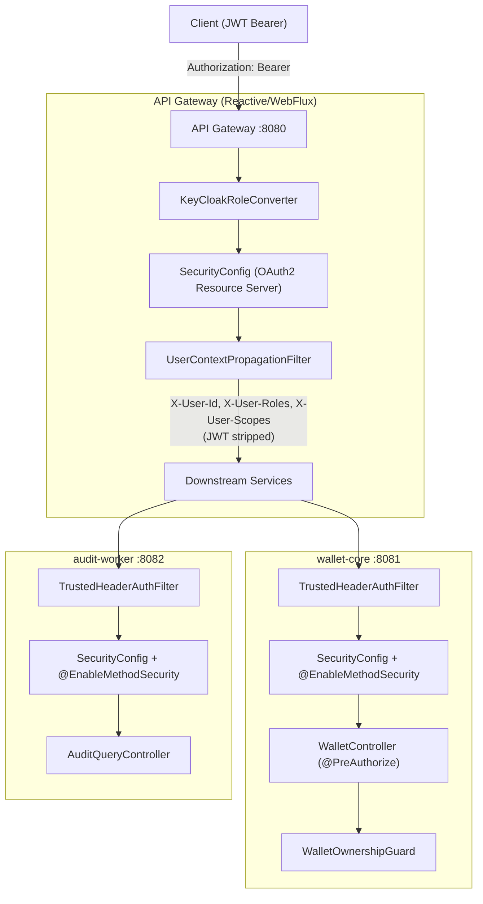
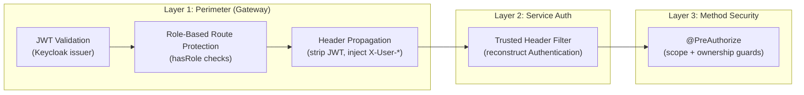

# 🔐 OAuth2/Keycloak Security Implementation — Full Change Analysis

**Branch:** `Feature/OAuth2-Secuirty-Implementation`
**Scope:** 20 modified + 11+ new files across **3 microservices**

---

## High-Level Architecture



---

## 1. API Gateway — Authentication & Authorization Edge

### [NEW] [KeyCloakRoleConverter.java](file:///c:/Users/parth/Flash-Wallet/flash-wallet/api-gateway/src/main/java/com/services/apigateway/config/KeyCloakRoleConverter.java)

Extracts authorities from Keycloak JWTs into Spring Security's model:
- **Roles** from `realm_access.roles` → prefixed with `ROLE_` (e.g., `ROLE_CUSTOMER`, `ROLE_ADMIN`)
- **Scopes** from `scope` claim (space-delimited) → prefixed with `SCOPE_` (e.g., `SCOPE_wallet:read`, `SCOPE_internal:debit`)

This dual extraction enables both role-based (`hasRole()`) and scope-based (`hasAuthority('SCOPE_...')`) authorization throughout the system.

---

### [MODIFY] [SecurityConfig.java](file:///c:/Users/parth/Flash-Wallet/flash-wallet/api-gateway/src/main/java/com/services/security/SecurityConfig.java)

Completely overhauled to be an **OAuth2 Resource Server** with role-based perimeter security:

| Priority | Path Pattern | Allowed Roles | Purpose |
|----------|-------------|---------------|---------|
| 1 | `/swagger-ui/**`, `/v3/api-docs/**` | `permitAll()` | Public API docs |
| 2 | `/actuator/health/**` | `permitAll()` | K8s probes |
| 3 | `/actuator/**` | `ADMIN` | Sensitive metrics |
| 4 | `GET /api/v1/audit/failures` | `ADMIN` | System failure tracking |
| 5 | `GET /api/v1/audit/**` | `ADMIN`, `AUDITOR` | Compliance logs |
| 6 | `POST /wallets/deposit`, `POST /wallets/transfer` | `CUSTOMER`, `SERVICE_CLIENT` | Financial mutations |
| 7 | `GET /wallets/transactions/**` | All 4 roles | Transaction polling |
| 8 | `GET /wallets/**` | All 4 roles | Wallet queries |
| 9 | `anyExchange()` | `authenticated()` | Catch-all security net |

Key design decisions:
- CSRF disabled (no browser client)
- Uses `ReactiveJwtAuthenticationConverterAdapter` to bridge the `KeyCloakRoleConverter` into the reactive WebFlux pipeline
- `POST /api/v1/wallets` (wallet creation) removed — now async via Kafka on user registration

---

### [NEW] [UserContextPropagationFilter.java](file:///c:/Users/parth/Flash-Wallet/flash-wallet/api-gateway/src/main/java/com/services/apigateway/filter/UserContextPropagationFilter.java)

**The bridge between JWT-based auth and header-based downstream auth.** Runs at order `HIGHEST_PRECEDENCE + 4` (5th in the GlobalFilter chain).

What it does:
1. Extracts `sub` claim from JWT → `X-User-Id` header
2. Extracts `ROLE_*` authorities → `X-User-Roles` header (comma-separated, stripped of `ROLE_` prefix)
3. Extracts `SCOPE_*` authorities → `X-User-Scopes` header (comma-separated, stripped of `SCOPE_` prefix)
4. **Strips the `Authorization` header** — downstream services never see the raw JWT

> [!IMPORTANT]
> This is the cornerstone of the "gateway-as-trust-boundary" pattern. Downstream services trust `X-User-*` headers because only the gateway can set them (external clients' headers are overwritten by this filter).

---

### [MODIFY] Filter Chain Order Updates

All existing filters were renumbered to accommodate the new `UserContextPropagationFilter`:

| Order | Filter | Type |
|-------|--------|------|
| `HIGHEST_PRECEDENCE` | [CorrelationIdFilter](file:///c:/Users/parth/Flash-Wallet/flash-wallet/api-gateway/src/main/java/com/services/apigateway/filter/CorrelationIdFilter.java) | GlobalFilter |
| `HIGHEST_PRECEDENCE + 1` | [AccessLogFilter](file:///c:/Users/parth/Flash-Wallet/flash-wallet/api-gateway/src/main/java/com/services/apigateway/filter/AccessLogFilter.java) | GlobalFilter |
| `HIGHEST_PRECEDENCE + 2` | [ContentTypeValidationFilter](file:///c:/Users/parth/Flash-Wallet/flash-wallet/api-gateway/src/main/java/com/services/apigateway/filter/ContentTypeValidationFilter.java) | GlobalFilter |
| `HIGHEST_PRECEDENCE + 3` | [IdempotencyHeaderValidationFilter](file:///c:/Users/parth/Flash-Wallet/flash-wallet/api-gateway/src/main/java/com/services/apigateway/filter/IdempotencyHeaderValidationFilter.java) | GlobalFilter |
| `HIGHEST_PRECEDENCE + 4` | **UserContextPropagationFilter** _(NEW)_ | GlobalFilter |
| `HIGHEST_PRECEDENCE` (WebFilter) | [SecurityHeadersFilter](file:///c:/Users/parth/Flash-Wallet/flash-wallet/api-gateway/src/main/java/com/services/apigateway/filter/SecurityHeadersFilter.java) | WebFilter |
| `LOWEST_PRECEDENCE` | [NotFoundResponseWebFilter](file:///c:/Users/parth/Flash-Wallet/flash-wallet/api-gateway/src/main/java/com/services/apigateway/filter/NotFoundResponseWebFilter.java) | WebFilter |

---

### [MODIFY] [GatewayRoutesConfiguration.java](file:///c:/Users/parth/Flash-Wallet/flash-wallet/api-gateway/src/main/java/com/services/apigateway/config/GatewayRoutesConfiguration.java)

Added a new route for the **audit-worker** service:

```java
.route("audit-worker-api", r -> r
    .path("/api/v1/audit/**")
    .and().method(HttpMethod.GET)   // Read-only
    .filters(f -> {
        f.requestRateLimiter(...)   // Same Redis rate limiter
        f.circuitBreaker(...)       // Isolated "auditWorkerCircuitBreaker"
        f.retry(...)                // 2 retries on 5xx with jittered backoff
        return f;
    })
    .uri(properties.getServices().getAuditWorkerUri()))
```

---

### [MODIFY] [ApiGatewayProperties.java](file:///c:/Users/parth/Flash-Wallet/flash-wallet/api-gateway/src/main/java/com/services/apigateway/config/ApiGatewayProperties.java)

Added `auditWorkerUri` to the `Services` inner class:
```java
@NotBlank
private String auditWorkerUri = "http://locahost:8082";  // ⚠️ typo: "locahost"
```

> [!WARNING]
> There's a typo in the default value: `"http://locahost:8082"` should be `"http://localhost:8082"`.

---

### [MODIFY] [FallbackController.java](file:///c:/Users/parth/Flash-Wallet/flash-wallet/api-gateway/src/main/java/com/services/apigateway/controller/FallbackController.java)

Added a circuit-breaker fallback endpoint for the audit-worker:
```java
@RequestMapping(value = "/fallback/audit-worker")
public Mono<GatewayErrorResponse> auditWorkerFallback(...)
```

---

### [MODIFY] [application.yml](file:///c:/Users/parth/Flash-Wallet/flash-wallet/api-gateway/src/main/resources/application.yml)

- Added OAuth2 resource server JWT configuration pointing to Keycloak:
  ```yaml
  spring.security.oauth2.resourceserver.jwt:
    issuer-uri: ${KEYCLOAK_ISSUER_URI:http://localhost:8000/realms/master}
  ```
- Added `Authorization` to allowed CORS headers
- Added `audit-worker-uri` to flash.gateway.services

---

### [MODIFY] [pom.xml](file:///c:/Users/parth/Flash-Wallet/flash-wallet/api-gateway/pom.xml) (api-gateway)

Added 3 new OAuth2 dependencies:
- `spring-boot-starter-security`
- `spring-security-oauth2-resource-server`
- `spring-security-oauth2-jose`

---

## 2. Wallet-Core — Trusted Header Auth & Ownership Guards

### [NEW] [TrustedHeaderAuthenticationFilter.java](file:///c:/Users/parth/Flash-Wallet/flash-wallet/wallet-core/src/main/java/com/services/wallet/filter/TrustedHeaderAuthenticationFilter.java)

A `OncePerRequestFilter` that reconstructs the Spring Security `Authentication` object from gateway-propagated headers:

```
X-User-Id     → auth.getName() (principal)
X-User-Roles  → ROLE_* GrantedAuthorities
X-User-Scopes → SCOPE_* GrantedAuthorities
```

Sets a `UsernamePasswordAuthenticationToken` into the `SecurityContextHolder` — making `@PreAuthorize`, `Authentication` injection, and `auth.getName()` all work seamlessly.

---

### [NEW] [SecurityConfig.java](file:///c:/Users/parth/Flash-Wallet/flash-wallet/wallet-core/src/main/java/com/services/wallet/security/SecurityConfig.java) (wallet-core)

Servlet-based security config:
- Inserts `TrustedHeaderAuthenticationFilter` before `UsernamePasswordAuthenticationFilter`
- Permits `/actuator/health`, restricts other actuator to `ADMIN`
- All other requests require authentication
- CSRF disabled, stateless sessions
- **`@EnableMethodSecurity`** — enables `@PreAuthorize` on controller methods

---

### [NEW] [WalletOwnershipGuard.java](file:///c:/Users/parth/Flash-Wallet/flash-wallet/wallet-core/src/main/java/com/services/wallet/service/WalletOwnershipGuard.java)

A `@Component("walletOwnershipGuard")` used in SpEL expressions within `@PreAuthorize`. Three guard methods:

| Method | Logic | Used By |
|--------|-------|---------|
| `assertWalletOwnership(walletId, auth)` | Loads wallet → checks `wallet.userId == auth.getName()` | transfer, deposit, getWallet |
| `assertUserIdMatch(userId, auth)` | Direct UUID comparison: `userId == auth.getName()` | getWalletByUserId |
| `assertTransactionIdMatch(txnId, auth)` | Custom query: checks if user is sender/receiver of transaction | getTransactionStatus |

All three throw `AccessDeniedException` on mismatch, return `true` on success (for SpEL).

---

### [MODIFY] [WalletController.java](file:///c:/Users/parth/Flash-Wallet/flash-wallet/wallet-core/src/main/java/com/services/wallet/controller/WalletController.java)

Every endpoint now has fine-grained `@PreAuthorize` with **scope + ownership** checks:

| Endpoint | Authorization Rule |
|----------|-------------------|
| `POST /transfer` | `SCOPE_internal:debit` **OR** (`SCOPE_wallet:write` **AND** sender wallet ownership) |
| `POST /deposit` | `SCOPE_internal:credit` **OR** (`SCOPE_wallet:write` **AND** wallet ownership) |
| `GET /{walletId}` | `SCOPE_wallet:read_all` **OR** (`SCOPE_wallet:read` **AND** wallet ownership) |
| `GET /user/{userId}` | `SCOPE_wallet:read_all` **OR** (`SCOPE_wallet:read` **AND** userId match) |
| `GET /transactions/{id}` | `SCOPE_transaction:read_all` **OR** (`SCOPE_transaction:read` **AND** transaction ownership) |

The pattern is consistent: **elevated scopes bypass guards, standard scopes require ownership verification**.

---

### [MODIFY] [TransactionRepository.java](file:///c:/Users/parth/Flash-Wallet/flash-wallet/wallet-core/src/main/java/com/services/wallet/repository/TransactionRepository.java)

Added a native query for the ownership guard:
```sql
SELECT COUNT(*) > 0 FROM transactions t
JOIN wallets w ON (w.user_id = t.sender_wallet_id OR w.user_id = t.receiver_wallet_id)
WHERE t.id = :transactionId AND w.user_id = :userId
```

> [!WARNING]
> **Potential SQL bug**: The JOIN condition uses `w.user_id = t.sender_wallet_id`, but `sender_wallet_id` is a **wallet ID**, not a **user ID**. The join should be `w.id = t.sender_wallet_id OR w.id = t.receiver_wallet_id` to correctly join wallets by their primary key, then filter by `w.user_id = :userId`.

---

### [MODIFY] [GlobalExceptionHandler.java](file:///c:/Users/parth/Flash-Wallet/flash-wallet/wallet-core/src/main/java/com/services/wallet/exception/GlobalExceptionHandler.java)

Added handler for `AccessDeniedException` → returns `403 FORBIDDEN`:
```java
@ExceptionHandler(AccessDeniedException.class)
public ResponseEntity<ErrorResponse> handleAccessDeniedException(...) {
    return buildResponse(HttpStatus.FORBIDDEN, "Access Denied", ex.getMessage(), request);
}
```

---

### [MODIFY] [WalletService.java](file:///c:/Users/parth/Flash-Wallet/flash-wallet/wallet-core/src/main/java/com/services/wallet/service/WalletService.java) & [pom.xml](file:///c:/Users/parth/Flash-Wallet/flash-wallet/wallet-core/pom.xml)

- `WalletService`: Minor cleanup — commented-out wallet creation POST reference
- `pom.xml`: Added `spring-boot-starter-security` dependency

---

## 3. Audit-Worker — New Query API & Security

### [NEW] [TrustedHeaderAuthenticationFilter.java](file:///c:/Users/parth/Flash-Wallet/flash-wallet/audit-worker/src/main/java/com/services/auditworker/filter/TrustedHeaderAuthenticationFilter.java)

Identical copy of the wallet-core filter — reconstructs `Authentication` from `X-User-*` headers.

### [NEW] [SecurityConfig.java](file:///c:/Users/parth/Flash-Wallet/flash-wallet/audit-worker/src/main/java/com/services/auditworker/security/SecurityConfig.java)

Identical pattern to wallet-core SecurityConfig — trusted header filter, stateless, `@EnableMethodSecurity`.

### [NEW] [AuditQueryController.java](file:///c:/Users/parth/Flash-Wallet/flash-wallet/audit-worker/src/main/java/com/services/auditworker/controller/AuditQueryController.java)

**Currently an empty class** — skeleton only. Will need endpoints wired to `AuditQueryService`.

### [NEW] [AuditQueryService.java](file:///c:/Users/parth/Flash-Wallet/flash-wallet/audit-worker/src/main/java/com/services/auditworker/service/AuditQueryService.java)

Provides query capabilities for audit data:
- `query(transactionId, eventType, pageable)` — filter by txnId or eventType, with Redis caching
- `findById(id)` — single lookup with `@Cacheable`
- `getFailure(pageable)` — paginated failure records

### [NEW] [AuditLogResponse.java](file:///c:/Users/parth/Flash-Wallet/flash-wallet/audit-worker/src/main/java/com/services/auditworker/dto/AuditLogResponse.java) & [AuditProcessingFailureResponse.java](file:///c:/Users/parth/Flash-Wallet/flash-wallet/audit-worker/src/main/java/com/services/auditworker/dto/AuditProcessingFailureResponse.java)

Java record DTOs for API responses.

### [MODIFY] [AuditLogRepository.java](file:///c:/Users/parth/Flash-Wallet/flash-wallet/audit-worker/src/main/java/com/services/auditworker/repository/AuditLogRepository.java)

Added paginated query methods:
```java
Page<AuditLog> findByTransactionId(UUID transactionId, Pageable pageable);
Page<AuditLog> findByEventType(String eventType, Pageable pageable);
```

### [MODIFY] [application.yml](file:///c:/Users/parth/Flash-Wallet/flash-wallet/audit-worker/src/main/resources/application.yml) & [pom.xml](file:///c:/Users/parth/Flash-Wallet/flash-wallet/audit-worker/pom.xml)

- Added Redis config for caching (`spring.data.redis`, `spring.cache.type: redis`, 60s TTL)
- Added `flash.gateway.services` block with upstream URIs
- Added dependencies: `spring-boot-starter-cache`, `spring-boot-starter-data-redis`, `spring-boot-starter-security`, `spring-boot-starter-web`, `spring-boot-starter-validation`

---

## ⚠️ Issues Found

| # | Severity | Location | Issue |
|---|----------|----------|-------|
| 1 | 🔴 **Critical** | [TransactionRepository.java:16](file:///c:/Users/parth/Flash-Wallet/flash-wallet/wallet-core/src/main/java/com/services/wallet/repository/TransactionRepository.java#L14-L19) | SQL JOIN uses `w.user_id = t.sender_wallet_id` but `sender_wallet_id` is a wallet UUID, not a user UUID. Should be `w.id = t.sender_wallet_id OR w.id = t.receiver_wallet_id` |
| 2 | 🟡 **Medium** | [ApiGatewayProperties.java:33](file:///c:/Users/parth/Flash-Wallet/flash-wallet/api-gateway/src/main/java/com/services/apigateway/config/ApiGatewayProperties.java#L33) | Typo in default URI: `"http://locahost:8082"` → should be `"http://localhost:8082"` |
| 3 | 🟡 **Medium** | [AuditQueryController.java](file:///c:/Users/parth/Flash-Wallet/flash-wallet/audit-worker/src/main/java/com/services/auditworker/controller/AuditQueryController.java) | Empty controller — no endpoints defined yet. Routes exist in gateway but nothing will be served |
| 4 | 🟡 **Medium** | TrustedHeaderAuthFilter (both services) | No guard against direct external calls bypassing the gateway. If port 8081/8082 is exposed, headers can be spoofed. Consider a shared secret or network-level isolation |
| 5 | 🟢 **Low** | [AuditQueryService.java:6](file:///c:/Users/parth/Flash-Wallet/flash-wallet/audit-worker/src/main/java/com/services/auditworker/service/AuditQueryService.java#L6) | Uses `TransactionalIdNotFoundException` from Kafka library for a "not found" case — should use a custom exception or `EntityNotFoundException` |
| 6 | 🟢 **Low** | [WalletController.java:51-53](file:///c:/Users/parth/Flash-Wallet/flash-wallet/wallet-core/src/main/java/com/services/wallet/controller/WalletController.java#L51-L53) | Dead commented-out code from previous ownership guard approach — should be cleaned up |

---

## Summary of Security Model



**4 roles defined:** `CUSTOMER`, `ADMIN`, `AUDITOR`, `SERVICE_CLIENT`

**Scope taxonomy:**
- `wallet:read` / `wallet:read_all` — view wallet(s)
- `wallet:write` — deposit/transfer (own wallet)
- `transaction:read` / `transaction:read_all` — view transaction(s)
- `internal:debit` / `internal:credit` — service-to-service privileged operations
