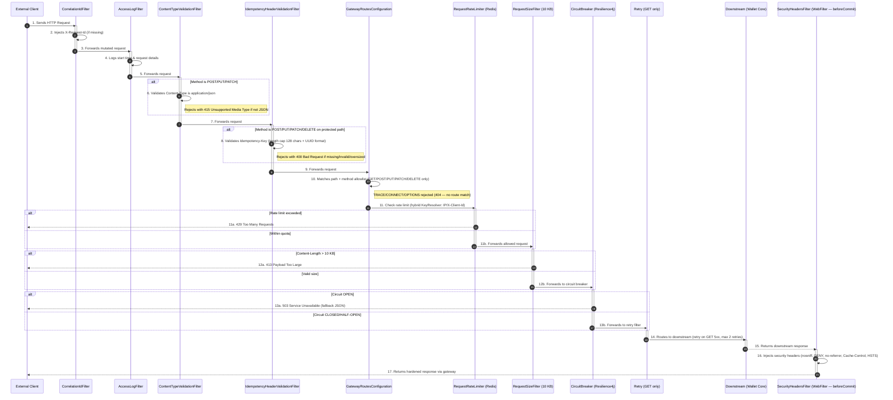
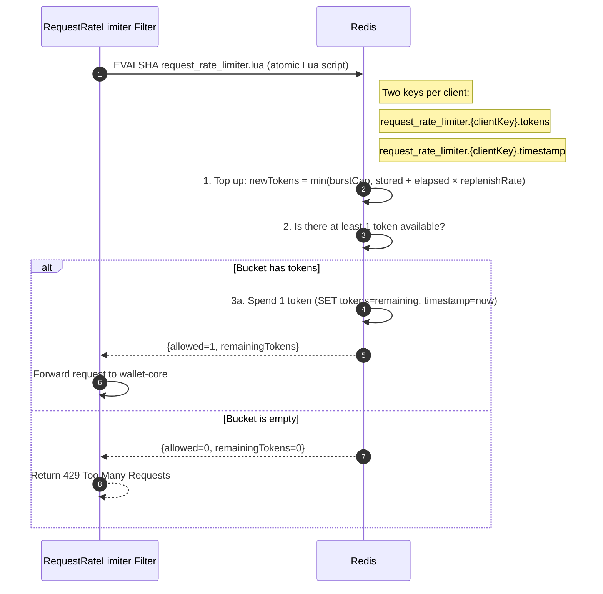

# API Gateway Service Summary

The **API Gateway** is the entry point for the Flash-Wallet microservices architecture. Built using Spring Cloud Gateway, it handles incoming HTTP requests, performs cross-cutting concerns (like generating correlation IDs, logging, and validating idempotency headers), and routes requests to the appropriate downstream services (e.g., `wallet-core`). It acts as a highly responsive, centralized proxy protecting the internal network.

## Design Flow: Which File Acts When?

Here is the step-by-step lifecycle of an HTTP request as it passes through the `api-gateway`.

### Filter Chain Processing Flow

```mermaid
flowchart TD
    req([HTTP Request]) --> shf

    subgraph WebFlux_Layer [Spring WebFlux WebFilter Chain]
        shf[1. SecurityHeadersFilter<br/><i>(Order: MIN+1)</i>]:::webflux
        fwh[2. FilteringWebHandler<br/><i>(Bridge into SCG)</i>]:::webflux
        shf --> fwh
    end

    subgraph SCG_Layer [Spring Cloud Gateway GlobalFilter Chain]
        cid[1. CorrelationIdFilter<br/><i>(Order: MIN+0)</i>]:::scg
        alf[2. AccessLogFilter<br/><i>(Order: MIN+2)</i>]:::scg
        ctv[3. ContentTypeValidationFilter<br/><i>(Order: MIN+4)</i>]:::scg
        idf[4. IdempotencyHeaderValidationFilter<br/><i>(Order: MIN+10)</i>]:::scg
        route[5. Routing to Downstream Service]:::external
        
        cid --> alf --> ctv --> idf --> route
    end

    fwh --> cid

    classDef webflux fill:#e8f4fd,stroke:#1d8cf8,stroke-width:2px,color:#000;
    classDef scg fill:#eafaf1,stroke:#2dcc70,stroke-width:2px,color:#000;
    classDef external fill:#fbfcfc,stroke:#7f8c8d,stroke-width:2px,color:#333;

    style WebFlux_Layer fill:#f7fbfe,stroke:#d0e7fc,stroke-width:1px;
    style SCG_Layer fill:#f9fdfa,stroke:#dcf7e7,stroke-width:1px;

    click shf "file:///c:/Users/parth/Flash-Wallet/flash-wallet/api-gateway/src/main/java/com/services/apigateway/filter/SecurityHeadersFilter.java" "Open SecurityHeadersFilter"
    click cid "file:///c:/Users/parth/Flash-Wallet/flash-wallet/api-gateway/src/main/java/com/services/apigateway/filter/CorrelationIdFilter.java" "Open CorrelationIdFilter"
    click alf "file:///c:/Users/parth/Flash-Wallet/flash-wallet/api-gateway/src/main/java/com/services/apigateway/filter/AccessLogFilter.java" "Open AccessLogFilter"
    click ctv "file:///c:/Users/parth/Flash-Wallet/flash-wallet/api-gateway/src/main/java/com/services/apigateway/filter/ContentTypeValidationFilter.java" "Open ContentTypeValidationFilter"
    click idf "file:///c:/Users/parth/Flash-Wallet/flash-wallet/api-gateway/src/main/java/com/services/apigateway/filter/IdempotencyHeaderValidationFilter.java" "Open IdempotencyHeaderValidationFilter"
```

<details>
<summary>🔍 <b>Click to inspect each filter's purpose and order</b></summary>

| Filter | Order Value | Layer | Description |
| :--- | :--- | :--- | :--- |
| **[SecurityHeadersFilter](file:///c:/Users/parth/Flash-Wallet/flash-wallet/api-gateway/src/main/java/com/services/apigateway/filter/SecurityHeadersFilter.java)** | `Integer.MIN_VALUE + 1` | Spring WebFlux WebFilter | Registers a callback to write security headers before committing response headers. |
| **[CorrelationIdFilter](file:///c:/Users/parth/Flash-Wallet/flash-wallet/api-gateway/src/main/java/com/services/apigateway/filter/CorrelationIdFilter.java)** | `Integer.MIN_VALUE + 0` | Spring Cloud Gateway GlobalFilter | Injects `X-Request-Id` UUID into the request context if not already present. |
| **[AccessLogFilter](file:///c:/Users/parth/Flash-Wallet/flash-wallet/api-gateway/src/main/java/com/services/apigateway/filter/AccessLogFilter.java)** | `Integer.MIN_VALUE + 2` | Spring Cloud Gateway GlobalFilter | Logs incoming request trace, method, path, and records latency. |
| **[ContentTypeValidationFilter](file:///c:/Users/parth/Flash-Wallet/flash-wallet/api-gateway/src/main/java/com/services/apigateway/filter/ContentTypeValidationFilter.java)** | `Integer.MIN_VALUE + 4` | Spring Cloud Gateway GlobalFilter | Restricts incoming requests to `application/json` for POST/PUT/PATCH. |
| **[IdempotencyHeaderValidationFilter](file:///c:/Users/parth/Flash-Wallet/flash-wallet/api-gateway/src/main/java/com/services/apigateway/filter/IdempotencyHeaderValidationFilter.java)** | `Integer.MIN_VALUE + 10` | Spring Cloud Gateway GlobalFilter | Enforces standard validation on mutating API requests (POST/PUT/PATCH/DELETE). |

</details>

### Flow: Request Routing Pipeline



Below is an exhaustive breakdown of every file within the `api-gateway` service and its exact purpose.

## 1. Configuration Layer (`config/`)

- **`GatewayRoutesConfiguration.java`**: Defines Spring Cloud Gateway routes using the fluent API. Each route specifies a predicate (e.g., path matching + HTTP method allowlist) and a destination URI. For example, routes like `GET/POST/PUT/PATCH/DELETE /api/v1/wallets/**` are mapped to `http://wallet-core:8081/**`. Includes a Resilience4j circuit breaker filter (configurable via `flash.gateway.resilience.circuit-breaker.enabled`) with a `/fallback/wallet-core` fallback, and a bounded retry filter (GET only, max 2 retries on 5xx/connect errors with jittered backoff). Disallowed HTTP methods (TRACE, CONNECT, OPTIONS outside CORS preflight) are rejected at the route predicate level — they never reach wallet-core. This file is the source-of-truth for all downstream service mappings.
- **`RateLimiterConfig.java`**: Configures Redis-backed rate limiting using Spring Cloud Gateway's `RequestRateLimiter` filter. Defines a hybrid `KeyResolver` that uses the `X-Client-Id` header if present, otherwise falls back to the source IP address. Rate-limit values (replenishRate, burstCapacity, requestedTokens) are externalized to `flash.gateway.rate-limit.*` properties with sensible defaults.
- **`GatewayStartupLogger.java`**: Logs all configured routes on application startup for operability and debugging.
- **`ApiGatewayProperties.java`**: Custom Spring Boot property class (with `@ConfigurationProperties`) that allows external configuration of gateway settings (e.g., timeout values, CORS origins, rate-limit numbers, resilience circuit-breaker enable/disable flag, security header toggles like HSTS, idempotency max header length). For local runs and small-scale deployments, this class intentionally retains static defaults (for example `walletCoreUri = "http://localhost:8081"`) as a fallback when YAML/env configuration is missing. Operational rule: YAML is the primary runtime source, but if endpoints/ports are changed, keep both `application.yml` and Java defaults synchronized to avoid drift.
- **`GatewayCorsConfiguration.java`**: Configures CORS (Cross-Origin Resource Sharing) to allow requests from approved frontend origins, specifying an explicit allowlist of headers (Content-Type, Idempotency-Key, X-Request-Id, X-Client-Id, X-Client, Authorization). `allowCredentials=false`.
- **`RedisReadinessIndicator.java`**: A custom reactive health indicator (`@Component("redisRateLimitStore")`) that checks Redis connectivity for the readiness probe. If Redis (the rate-limit backing store) is unreachable, the readiness endpoint reports DOWN.

## 2. Filter Layer (`filter/`)

*Filters are the "middleware" of the gateway, executing custom logic for every request/response pair.*

- **`CorrelationIdFilter.java`**: A gateway filter factory that injects a unique `X-Request-Id` UUID into every incoming request (if not already present). This correlation ID is propagated downstream to all microservices and logs, enabling end-to-end request tracing and debugging.
- **`AccessLogFilter.java`**: Records incoming request details (method, path, source IP, timestamp, request headers) at INFO level before forwarding to the downstream service. After receiving the response, it logs response status and elapsed time. Useful for traffic auditing and performance monitoring.
- **`ContentTypeValidationFilter.java`**: Rejects POST/PUT/PATCH requests that do not carry `Content-Type: application/json` with a 415 Unsupported Media Type response. Runs at order `HIGHEST_PRECEDENCE + 4` — before the idempotency filter (+10) — so that invalid Content-Type is caught first. Saves wallet-core a deserialization round-trip and produces a uniform 415 from the gateway.
- **`IdempotencyHeaderValidationFilter.java`**: Validates the `Idempotency-Key` header on all mutating requests (POST, PUT, PATCH, DELETE) to protected paths. Enforces a 128-character length cap to prevent header-stuffing attacks (even when `strictUuid=false`). When strict UUID mode is enabled, validates UUID format and rejects non-UUID keys with a 400 Bad Request response. This upstream check complements the downstream idempotency aspect in wallet-core.
- **`SecurityHeadersFilter.java`**: A `WebFilter` (not a `GlobalFilter`) at the Spring WebFlux layer that injects security headers on every response using `beforeCommit()`. This ensures headers are applied to all responses including circuit-breaker fallbacks and error handler responses. Runs at `HIGHEST_PRECEDENCE + 1`. Headers injected: `X-Content-Type-Options: nosniff`, `X-Frame-Options: DENY`, `Referrer-Policy: no-referrer`, `Cache-Control: no-store` (on `/api/v1/wallets/**` paths), and `Strict-Transport-Security` (configurable via `flash.gateway.security.hsts-enabled`, off in dev).
- **`RequestSizeFilter.java`**: Rejects requests whose `Content-Length` exceeds a configurable threshold (default 10 KB) with a 413 Payload Too Large response. This protects downstream services from memory exhaustion and DOS attacks.

## 3. Exception Handling (`exception/`)

- **`GatewayErrorResponse.java`**: A simple DTO record that wraps error details (timestamp, status code, error message, path) for consistent JSON error responses from the gateway.
- **`GatewayExceptionHandler.java`**: A `@ControllerAdvice` (or error handler hook) that catches exceptions at the gateway level (e.g., `RouteNotFoundException`, `UnsupportedMediaTypeException`) and returns standardized error responses in JSON format.

## 4. Security & Utilities (`util/`)

- **`ApiGatewayApplication.java`**: The Spring Boot application entry point, annotated with `@SpringBootApplication` and `@ConfigurationPropertiesScan`.

## 5. Controller Layer (`controller/`)

- **`FallbackController.java`**: Handles circuit breaker fallback requests. When the Resilience4j circuit breaker on the wallet-core route opens, requests are forwarded to `/fallback/wallet-core`, which returns a 503 Service Unavailable response wrapped in the standard `GatewayErrorResponse` JSON envelope.

---

## Redis Design Flow: Rate Limiting

> **The problem it solves**: Without rate limiting, a single client or a bot could flood wallet-core with thousands of requests per second. Redis enforces a per-client quota at the gateway edge — before the request ever reaches business logic.

Redis is the **only stateful dependency of the API Gateway**, used exclusively for token-bucket rate limiting.

### Step 1 — Who is the client?

Before checking any quota, the gateway identifies *who* is making the request using `hybridKeyResolver`:

```
Incoming request
     │
     ├─ Has X-Client-Id header? ──YES──► quota bucket = X-Client-Id value
     │
     └─ NO ──────────────────────────► quota bucket = remote IP address
```

Known API clients (sending `X-Client-Id`) get their own independent bucket. Anonymous or browser traffic is bucketed by IP.

### Step 2 — Token bucket check

Imagine every client has a bucket of tokens. Each request spends one token. Tokens refill at a steady rate up to a maximum (burst cap).



> **`EVALSHA`** runs the entire read→calculate→write as a single atomic Lua script inside Redis — no race conditions even with multiple gateway pods hitting the same Redis. The `{clientKey}` in the key names ensures rate limits are enforced globally across the cluster, not per pod.

### Step 3 — Configuration

| Property (`flash.gateway.rate-limit.*`) | Default | Lua arg passed to Redis | Plain-language meaning |
|-----------------------------------------|---------|------------------------|------------------------|
| `replenishRate` | 10 | `rate` | Tokens added per second — the steady long-term speed limit |
| `burstCapacity` | 20 | `capacity` | Maximum tokens the bucket can hold — allows short bursts above the steady rate |
| `requestedTokens` | 1 | `requested` | Tokens spent per request |

**Example with defaults**: a client can fire up to 20 requests in a burst, but can only sustain 10 requests/second before receiving 429s.

### What happens when Redis is unavailable

If Redis goes down the gateway cannot enforce rate limits, so it refuses new traffic rather than letting everything through unchecked:
- `RedisReadinessIndicator` sets the readiness probe to `DOWN`
- Kubernetes removes the pod from the load balancer until Redis recovers

---

## Resilience

### Circuit Breaker (Resilience4j)

The wallet-core route is protected by a Spring Cloud CircuitBreaker filter backed by Resilience4j. When downstream failures exceed the configured threshold, the circuit opens and requests are short-circuited to the fallback endpoint (`/fallback/wallet-core`) which returns a 503 JSON response immediately — protecting wallet-core from cascading failures.

**Configuration** (externalized in `application.yml` under `resilience4j.circuitbreaker`):

- `sliding-window-size`: Number of calls considered for failure rate calculation (default: 10)
- `failure-rate-threshold`: Percentage of failures to trip the circuit (default: 50%)
- `slow-call-duration-threshold`: Duration above which a call is considered slow (default: 5s)
- `wait-duration-in-open-state`: How long the circuit stays open before transitioning to half-open (default: 30s)
- `permitted-number-of-calls-in-half-open-state`: Probe calls allowed in half-open state (default: 3)
- Feature flag: `flash.gateway.resilience.circuit-breaker.enabled` (default: true)

### Bounded Retry

GET requests to wallet-core are retried up to 2 times on 5xx or connection errors with jittered exponential backoff (100ms–1000ms, factor 2). Mutating verbs (POST/PUT/PATCH/DELETE) are **never** auto-retried — that is the client's responsibility under the idempotency-key contract.

---

## Security Headers

The `SecurityHeadersFilter` (a `WebFilter` at `HIGHEST_PRECEDENCE + 1` using `beforeCommit()`) injects the following headers on every response — including circuit-breaker fallbacks and error handler responses:

| Header | Value | Scope |
|--------|-------|-------|
| `X-Content-Type-Options` | `nosniff` | All responses |
| `X-Frame-Options` | `DENY` | All responses |
| `Referrer-Policy` | `no-referrer` | All responses |
| `Cache-Control` | `no-store` | `/api/v1/wallets/**` paths only |
| `Strict-Transport-Security` | `max-age=31536000; includeSubDomains` | Configurable: `flash.gateway.security.hsts-enabled` (off in dev) |

---

## Actuator

The gateway exposes Kubernetes-ready health probes and Prometheus metrics:

| Endpoint | Purpose |
|----------|---------|
| `/actuator/health/liveness` | Liveness probe — basic Spring Boot health |
| `/actuator/health/readiness` | Readiness probe — includes custom `RedisReadinessIndicator` (fails if Redis is unreachable) |
| `/actuator/prometheus` | Prometheus metrics scrape endpoint |
| `/actuator/metrics` | Micrometer metrics endpoint |

Only health, prometheus, and metrics endpoints are exposed. Sensitive endpoints (`/env`, `/heapdump`, `/beans`) are **not** exposed.

Spring Cloud Gateway's built-in `gateway.requests` Micrometer timer is enabled with path tag dimensions, providing per-route latency and status code metrics out of the box.

---

## Architecture Notes

- **Spring Cloud Gateway**: Non-blocking, reactive gateway using Netty and Project Reactor. Scales horizontally.
- **Stateless Design**: All gateway instances are identical; requests can be routed to any instance (horizontal scalability).
- **Downstream Protocol**: Currently HTTP synchronous to `wallet-core` and other services. For async workloads (e.g., audit-worker Kafka consumers), events are published directly from wallet-core, bypassing the gateway.
- **Resilience**: Circuit breaker (Resilience4j) protects wallet-core from cascading failures. Bounded retry (GET only, jittered backoff) handles transient downstream errors. Mutating verbs are never auto-retried.
- **Security**: Rate limiting prevents brute-force attacks. Request size limits prevent DOS. Idempotency-Key validation with 128-char length cap and optional strict UUID enforcement. Content-Type allowlist rejects non-JSON mutating requests at the gateway. Security response headers (nosniff, DENY, no-referrer, HSTS) harden the HTTP contract. Method allowlist prevents TRACE/CONNECT/OPTIONS from reaching downstream services.
- **Observability**: Actuator liveness/readiness probes (readiness gated on Redis). Prometheus metrics endpoint. Spring Cloud Gateway built-in Micrometer timers with per-route dimensions.

---

## Build & Deployment Notes

- **Java**: Requires JDK 21+ (consistent with wallet-core)
- **Maven**: Standalone module. Build with `mvn clean install` from `api-gateway/` directory.
- **Docker**: Runs on port `8080` by default. Configured in [docker-compose.yml](../docker-compose.yml).
- **Downstream Services**: Gateway routes HTTP traffic only to `http://wallet-core:8081` (internal Docker network name). The `audit-worker` service is **not** a gateway upstream — it is a pure Kafka consumer that receives events published by `wallet-core` asynchronously, bypassing the gateway entirely.
- **Redis**: Required for rate limiting state (shared across gateway instances in a cluster) and readiness health check.
- **Actuator**: Liveness at `/actuator/health/liveness`, readiness at `/actuator/health/readiness`, Prometheus at `/actuator/prometheus`.
