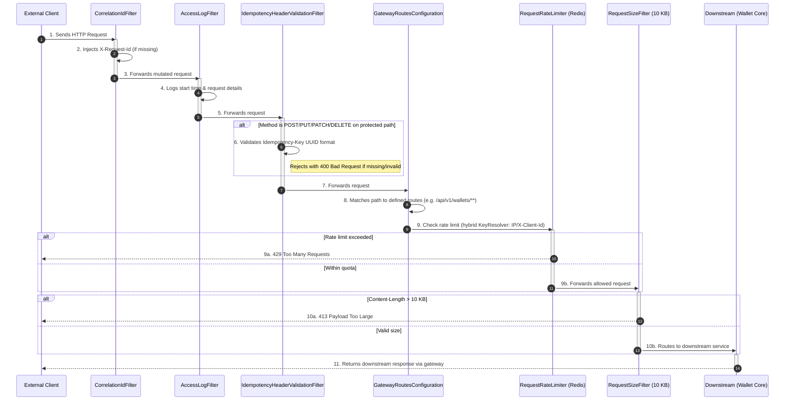

# API Gateway Service Summary

The **API Gateway** is the entry point for the Flash-Wallet microservices architecture. Built using Spring Cloud Gateway, it handles incoming HTTP requests, performs cross-cutting concerns (like generating correlation IDs, logging, and validating idempotency headers), and routes requests to the appropriate downstream services (e.g., `wallet-core`). It acts as a highly responsive, centralized proxy protecting the internal network.

## Design Flow: Which File Acts When?

Here is the step-by-step lifecycle of an HTTP request as it passes through the `api-gateway`.

### Flow: Request Routing Pipeline

Below is an exhaustive breakdown of every file within the `api-gateway` service and its exact purpose.

## 1. Configuration Layer (`config/`)
- **`GatewayRoutesConfiguration.java`**: Defines Spring Cloud Gateway routes using the fluent API. Each route specifies a predicate (e.g., path matching) and a destination URI. For example, routes like `GET /api/v1/wallets/**` are mapped to `http://wallet-core:8081/**`. This file is the source-of-truth for all downstream service mappings.
- **`RateLimiterConfig.java`**: Configures Redis-backed rate limiting using Spring Cloud Gateway's `RequestRateLimiter` filter. Defines a hybrid `KeyResolver` that uses the `X-Client-Id` header if present, otherwise falls back to the source IP address. Specifies replenish rate (requests per second) and requested tokens per request.
- **`GatewayStartupLogger.java`**: Logs all configured routes on application startup for operability and debugging.
- **`ApiGatewayProperties.java`**: Custom Spring Boot property class (with `@ConfigurationProperties`) that allows external configuration of gateway settings (e.g., timeout values, CORS origins) via `application.yml`.
- **`GatewayCorsConfiguration.java`**: Configures CORS (Cross-Origin Resource Sharing) to allow requests from approved frontend origins, specifying allowed headers and methods.

## 2. Filter Layer (`filter/`)
*Filters are the "middleware" of the gateway, executing custom logic for every request/response pair.*
- **`CorrelationIdFilter.java`**: A gateway filter factory that injects a unique `X-Request-Id` UUID into every incoming request (if not already present). This correlation ID is propagated downstream to all microservices and logs, enabling end-to-end request tracing and debugging.
- **`AccessLogFilter.java`**: Records incoming request details (method, path, source IP, timestamp, request headers) at INFO level before forwarding to the downstream service. After receiving the response, it logs response status and elapsed time. Useful for traffic auditing and performance monitoring.
- **`IdempotencyHeaderValidationFilter.java`**: Validates the `Idempotency-Key` header on all mutating requests (POST, PUT, PATCH, DELETE) to protected paths. It enforces UUID format and rejects non-UUID keys with a 400 Bad Request response. This upstream check complements the downstream idempotency aspect in wallet-core.
- **`RequestSizeFilter.java`**: Rejects requests whose `Content-Length` exceeds a configurable threshold (default 10 KB) with a 413 Payload Too Large response. This protects downstream services from memory exhaustion and DOS attacks.

## 3. Exception Handling (`exception/`)
- **`GatewayErrorResponse.java`**: A simple DTO record that wraps error details (timestamp, status code, error message, path) for consistent JSON error responses from the gateway.
- **`GatewayExceptionHandler.java`**: A `@ControllerAdvice` (or error handler hook) that catches exceptions at the gateway level (e.g., `RouteNotFoundException`, `UnsupportedMediaTypeException`) and returns standardized error responses in JSON format.

## 4. Security & Utilities (`util/`)
- **`ApiGatewayApplication.java`**: The Spring Boot application entry point, annotated with `@SpringBootApplication` and `@EnableDiscoveryClient` to enable service discovery (if Eureka is configured).

---

## Architecture Notes

- **Spring Cloud Gateway**: Non-blocking, reactive gateway using Netty and Project Reactor. Scales horizontally.
- **Stateless Design**: All gateway instances are identical; requests can be routed to any instance (horizontal scalability).
- **Downstream Protocol**: Currently HTTP synchronous to `wallet-core` and other services. For async workloads (e.g., audit-worker Kafka consumers), events are published directly from wallet-core, bypassing the gateway.
- **Security**: Rate limiting prevents brute-force attacks. Request size limits prevent DOS. Idempotency-Key validation ensures client idempotency awareness before reaching the core service.

---

## Build & Deployment Notes

- **Java**: Requires JDK 21+ (consistent with wallet-core)
- **Maven**: Standalone module. Build with `mvn clean install` from `api-gateway/` directory.
- **Docker**: Runs on port `8080` by default. Configured in [docker-compose.yml](../docker-compose.yml).
- **Downstream Services**: Gateway is configured to route to `http://wallet-core:8081` and `http://audit-worker:8082` (internal Docker network names).
- **Redis**: Required for rate limiting state (shared across gateway instances in a cluster).
