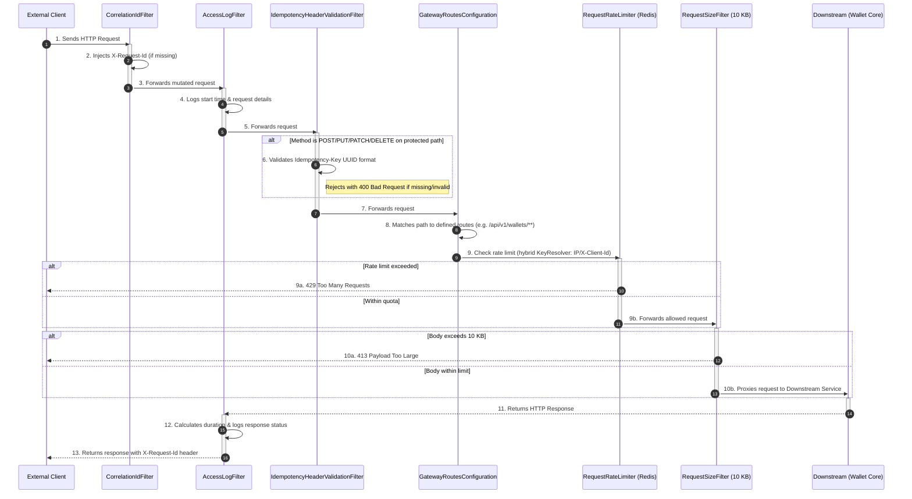

# API Gateway Service Summary

The **API Gateway** is the entry point for the Flash-Wallet microservices architecture. Built using Spring Cloud Gateway, it handles incoming HTTP requests, performs cross-cutting concerns (like generating correlation IDs, logging, and validating idempotency headers), and routes requests to the appropriate downstream services (e.g., `wallet-core`). It acts as a highly responsive, centralized proxy protecting the internal network.

## Design Flow: Which File Acts When?

Here is the step-by-step lifecycle of an HTTP request as it passes through the `api-gateway`.

### Flow: Request Routing Pipeline

Below is an exhaustive breakdown of every file within the `api-gateway` service and its exact purpose.

## 1. Root & Configuration Files
- **`pom.xml`**: Maven configuration pulling in Spring Cloud Gateway dependencies, enabling reactive web routing based on Project Reactor.
- **`Dockerfile`**: Defines the Docker container setup for deploying the API Gateway.
- **`ApiGatewayApplication.java`**: The Spring Boot entry point that bootstraps the Gateway service.

## 2. Configuration Layer (`config/`)
- **`ApiGatewayProperties.java`**: Strongly-typed configuration class matching the `flash.gateway` prefix in `application.yml`. Holds properties for routing URIs, HTTP client timeouts, CORS rules, logging thresholds, and paths requiring strict idempotency.
- **`GatewayCorsConfiguration.java`**: Configures Cross-Origin Resource Sharing (CORS) using a `CorsWebFilter`. It applies the allowed origins, methods, and exposed headers (like `X-Request-Id`) globally based on the configuration properties.
- **`GatewayRoutesConfiguration.java`**: The core routing engine setup. Uses `RouteLocatorBuilder` to map specific path patterns (e.g., `/api/v1/wallets/**`, `/swagger-ui/**`) directly to the `wallet-core` downstream URI. It applies request size limits (10 KB) and Redis-backed rate limiting filters to downstream routes.
- **`RateLimiterConfig.java`**: Configures Redis-backed rate limiting. Defines a hybrid `KeyResolver` that enforces strict IP-based rate limiting on authentication endpoints (`/api/v1/auth/**`), and checks `X-Client-Id` or `X-Client` headers (with IP fallback) for all other wallet core requests.
- **`GatewayStartupLogger.java`**: An event listener that logs the configured properties and registered routes to the console as soon as the application is fully started, aiding in deployment verification.

## 3. Filter Layer (`filter/`)
*Filters intercept requests globally to apply logic before or after they reach the downstream service.*
- **`CorrelationIdFilter.java`**: Executes first (Highest Precedence). Ensures every incoming request has an `X-Request-Id` header. If absent, it generates a new UUID. This trace ID is attached to the request attributes and injected into the final response headers, allowing distributed tracing across all microservices.
- **`AccessLogFilter.java`**: Executes after the Correlation filter. Logs the incoming request details (method, path, remote address). It measures execution time, and upon completion, logs whether the response was successful, a client error, a server error, or unusually slow based on configured thresholds.
- **`IdempotencyHeaderValidationFilter.java`**: Evaluates modifying HTTP methods (POST, PUT, PATCH, DELETE) against specific protected paths (like `/api/v1/wallets/transfer`). It enforces that an `Idempotency-Key` header exists and is a valid UUID, returning a 400 Bad Request if validation fails, preventing duplicate transaction attempts from reaching the core.
- **`NotFoundResponseWebFilter.java`**: A fallback filter with the lowest precedence. It catches unhandled 404 (Not Found) or 405 (Method Not Allowed) errors when a request fails to match any gateway routes, returning a standardized JSON error response rather than a default empty one.

## 4. Exception Layer (`exception/`)
- **`GatewayExceptionHandler.java`**: Implements `ErrorWebExceptionHandler` to catch exceptions globally (e.g., routing failures, downstream connection timeouts, or unresolvable hosts). It maps these errors to appropriate HTTP statuses (like `503 Service Unavailable` or `504 Gateway Timeout`), logs the failure securely, and serializes a structured JSON response.
- **`GatewayErrorResponse.java`**: A Java Record representing the standardized JSON structure returned by the gateway during an error. It includes the timestamp, status code, error label, human-readable message, request path, and trace ID.

## 5. Utility Layer (`util/`)
- **`LogSanitizer.java`**: A helper component used by `AccessLogFilter` when verbose header logging is enabled. It truncates extremely long header values and masks sensitive headers (like `Authorization` and `Cookie`) with `***` to prevent logging sensitive user data.
