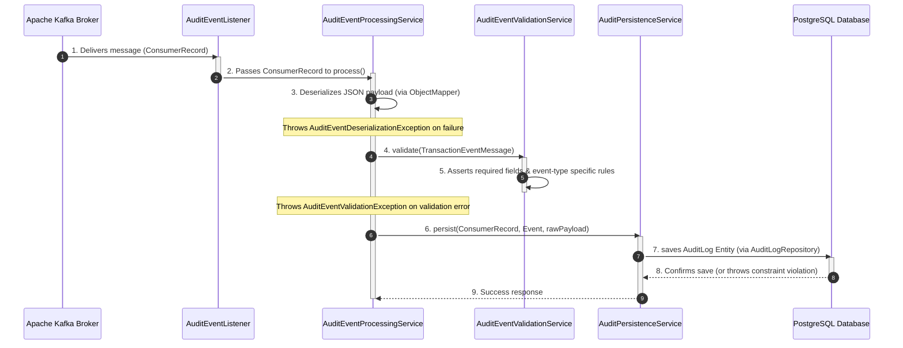
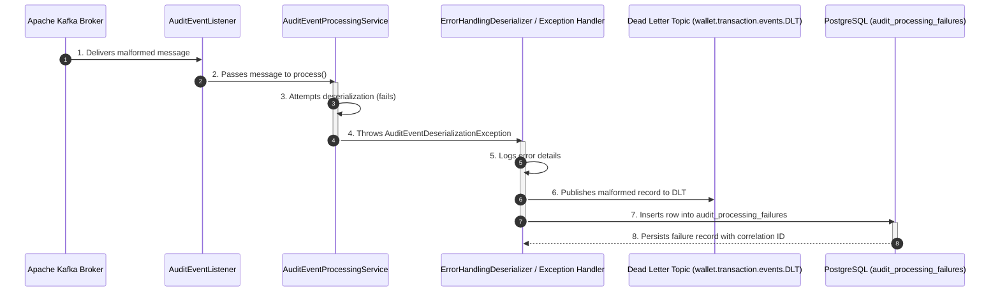

# Audit Worker Service Summary

The **Audit Worker** is a consumer-driven microservice in the Flash-Wallet ecosystem. Its primary responsibility is to asynchronously listen for financial transaction events (like transfers and deposits) via Apache Kafka, validate these events, and securely persist them into an audit log database. It is designed to be highly resilient, featuring robust error handling, database-level idempotency, and a Dead Letter Topic (DLT) recovery mechanism for unprocessable events.

## Design Flow: Which File Acts When?

Here is the step-by-step lifecycle of a message within the `audit-worker` service, showing which class executes at each phase.

### Flow A: Successful Audit Processing Pipeline

### Flow B: Error Handling & DLT Routing

Below is an exhaustive breakdown of every file within the `audit-worker` service and its exact purpose.

## 1. Consumer Layer (`consumer/`)
- **`AuditEventListener.java`**: A Kafka `@KafkaListener` component that polls the broker for messages on `wallet.transaction.events`. For each `ConsumerRecord`, it invokes the `process()` method in `AuditEventProcessingService`. The listener is configured to run in its own thread pool for non-blocking polling.

## 2. Message Processing Layer (`service/`)
- **`AuditEventProcessingService.java`**: The orchestration service that:
  1. Deserializes the raw Kafka string payload into a `TransactionEventMessage` using Jackson's `ObjectMapper`.
  2. Calls `AuditEventValidationService` to validate required fields (e.g., transactionId, eventType).
  3. Calls `AuditPersistenceService` to save the event as an `AuditLog` entity.
  4. Returns successfully, allowing the Kafka offset to advance.
  5. On error (deserialization, validation, or persistence), rethrows the exception, which is caught by the error handler and routed to the DLT.

- **`AuditEventValidationService.java`**: Stateless validator that inspects `TransactionEventMessage` fields and enforces business rules:
  - Verifies `transactionId` is a valid UUID.
  - Verifies `eventType` is one of `WALLET_TRANSFER_COMPLETED`, `WALLET_TRANSFER_SAGA_FAILED`, or `WALLET_DEPOSIT_COMPLETED` (any other value throws `AuditEventValidationException`).
  - Verifies `amount` is positive.
  - For transfer events (`WALLET_TRANSFER_COMPLETED`, `WALLET_TRANSFER_SAGA_FAILED`), asserts both `senderWalletId` and `receiverWalletId` are non-null.
  - For deposit events, asserts only `receiverWalletId` is non-null.

- **`AuditPersistenceService.java`**: Persists validated events to the database:
  1. Retrieves the Kafka partition and offset from the `ConsumerRecord` metadata.
  2. Constructs an `AuditLog` entity with all message fields plus Kafka offset metadata.
  3. Saves via `AuditLogRepository.save()`.
  4. If a database constraint is violated (e.g., duplicate `transactionId` from a redelivery), it logs a warning and silently succeeds (idempotent design).

## 3. DTO Layer (`dto/`)
- **`TransactionEventMessage.java`**: An immutable Java `record` representing the Kafka message payload. Fields include:
  - `transactionId` (UUID)
  - `idempotencyKey` (String)
  - `senderWalletId` (nullable UUID, for deposits)
  - `receiverWalletId` (UUID)
  - `amount` (long, in lowest denomination)
  - `currency` (3-char ISO code)
  - `status` (String: `COMPLETED`, `DEBIT_COMPLETED`, `COMPENSATED`, `FAILED` — values from `TransactionStatus` enum)
  - `eventType` (String: `WALLET_TRANSFER_COMPLETED`, `WALLET_TRANSFER_SAGA_FAILED`, `WALLET_DEPOSIT_COMPLETED`)
  - `timestamp` (Instant)

## 4. Entity & Repository Layer (`entity/`, `repository/`)
- **`AuditLog.java`**: JPA entity mapping to the `audit_logs` table. Stores a row for each processed transaction event, including:
  - `id` (UUID primary key)
  - `transactionId` (indexed, not unique due to potential retries, but application logic treats it as unique per Kafka partition/offset)
  - `kfkPartition`, `kafkaOffset` (to track which Kafka partition/offset this row came from)
  - `senderWalletId`, `receiverWalletId`, `amount`, `currency`, `status`, `eventType`, `timestamp`
  - `createdAt` (database timestamp)

- **`AuditProcessingFailure.java`**: JPA entity mapping to the `audit_processing_failures` table. Used for error tracking:
  - `id` (UUID)
  - `correlationId` (X-Request-Id from the original transaction for end-to-end tracing)
  - `kafkaPartition`, `kafkaOffset` (Kafka metadata of the failed message)
  - `rawPayload` (the raw JSON string that failed deserialization/validation)
  - `errorMessage` (exception message and stack trace)
  - `createdAt` (when the failure was recorded)

- **`AuditLogRepository.java` & `AuditProcessingFailureRepository.java`**: Spring Data JPA repositories for basic CRUD operations.

## 5. Exception Layer (`exception/`)
- **`AuditEventDeserializationException.java`**: Thrown when Jackson fails to deserialize a Kafka message (e.g., malformed JSON, type mismatch). Non-retryable by default, immediately routed to the DLT.
- **`AuditEventValidationException.java`**: Thrown when a deserialized event fails business logic validation (e.g., missing field, invalid enum). Non-retryable.
- **`AuditEventProcessingException.java`**: A generic parent exception for audit-specific errors.

## 6. Configuration Layer (`config/`)
- **`KafkaConsumerConfig.java`**: Configures the Kafka consumer:
  - Consumer group: `audit-worker-group`
  - Offset reset strategy: `earliest` (start from the beginning on first run)
  - Concurrency: configurable thread pool for parallel message consumption
  - Error handler: reroutes deserialization or processing errors to a Dead Letter Topic
  - Partition assignment: balances partitions across consumer instances

- **`AuditWorkerProperties.java`**: Custom `@ConfigurationProperties` for externalizing kafka topics, database settings, and retry policies via `application.yml`.
- **Configuration Source Policy (Current)**: For local runs and small-scale product use, runtime values are primarily sourced from `application.yml` (and environment overrides), while `@ConfigurationProperties` classes may keep Java-level fallback defaults for minimal-environment resiliency. If YAML binding is missing or unavailable, static defaults can take effect. Team rule: when changing service URLs, topic names, hostnames, or ports, update both `application.yml` and corresponding Java defaults to avoid configuration drift.

- **`JacksonSecurityConfig.java`**: Same security hardening as wallet-core: disables polymorphic deserialization and enforces strict type handling.

## 7. Startup & Shutdown (`AuditWorkerApplication.java`)
- Spring Boot application entry point. Enables Kafka auto-configuration and starts listening for messages on application startup.

---

## Error Handling & Resilience Strategy

1. **Database Duplicates (Idempotent Writes)**
   - If the same message is redelivered (e.g., due to a broker replica failure during offset commit), the `AuditLog` table has a unique index on `(kafkaPartition, kafkaOffset)`. The insertion succeeds silently if the row already exists (conflict-ignored).

2. **Deserialization Errors**
   - If Kafka delivers a message that cannot be deserialized (e.g., corrupted JSON), the consumer error handler catches the exception, publishes the original message to the DLT, and persists the failure details to `audit_processing_failures`.

3. **Validation Errors**
   - If a message deserializes but fails business logic validation, `AuditEventValidationException` is thrown and handled similarly (DLT + failure record).

4. **Database Connectivity**
   - If the database is temporarily unavailable, the exception bubbles up, Kafka does not commit the offset, and the consumer automatically retries the message after a backoff period. Once the database is back online, processing resumes.

---

## Build & Deployment Notes

- **Java**: Requires JDK 21+
- **Maven**: Standalone module. Build with `mvn clean install` from `audit-worker/` directory.
- **Docker**: Runs on port `8082` (internally, not exposed). Configured in [docker-compose.yml](../docker-compose.yml).
- **Kafka**: Consumes from `wallet.transaction.events` topic. DLT auto-created at `wallet.transaction.events.DLT`.
- **Database**: Requires `audit_worker_db` PostgreSQL database with tables `audit_logs` and `audit_processing_failures`.
- **Horizontally Scalable**: Deploy multiple instances with the same `consumer group` for automatic partition rebalancing.
