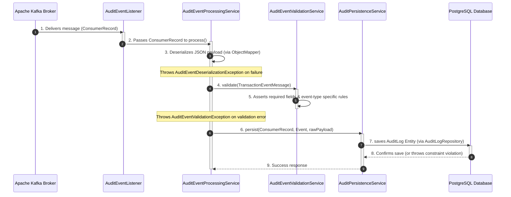
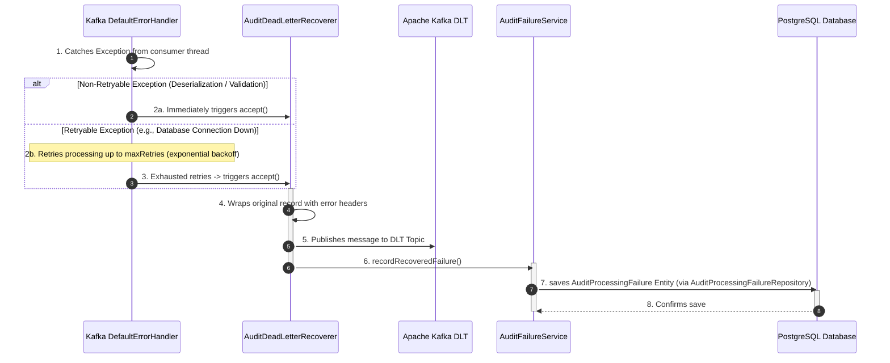

# Audit Worker Service Summary

The **Audit Worker** is a consumer-driven microservice in the Flash-Wallet ecosystem. Its primary responsibility is to asynchronously listen for financial transaction events (like transfers and deposits) via Apache Kafka, validate these events, and securely persist them into an audit log database. It is designed to be highly resilient, featuring robust error handling, database-level idempotency, and a Dead Letter Topic (DLT) recovery mechanism for unprocessable events.

## Design Flow: Which File Acts When?

Here is the step-by-step lifecycle of a message within the `audit-worker` service, showing which class executes at each phase.

### Flow A: Successful Audit Processing Pipeline

1. **`AuditEventListener.java`** polls the Kafka broker and receives a `ConsumerRecord<String, String>` from the configured topic.
2. The listener invokes the `process()` method in **`AuditEventProcessingService.java`**.
3. **`AuditEventProcessingService.java`** attempts to deserialize the raw string value of the record using Jackson's `ObjectMapper` into a **`TransactionEventMessage.java`** DTO.
   - *If it fails, it throws a non-retryable `AuditEventDeserializationException.java`.*
4. The processing service hands the message DTO to **`AuditEventValidationService.java`** to ensure it contains required fields and respects transaction business rules.
   - *If validation fails, it throws a non-retryable `AuditEventValidationException.java`.*
5. Upon successful validation, **`AuditEventProcessingService.java`** calls **`AuditPersistenceService.java`** to save the audit log.
6. **`AuditPersistenceService.java`** maps the DTO and record metadata to an **`AuditLog.java`** entity and persists it via **`AuditLogRepository.java`** to the database.
   - **`PersistenceExceptionClassifier.java`** is triggered if a database exception occurs to check if it's a duplicate record (using database unique key constraint `uk_audit_logs_partition_offset`). If duplicate, the error is caught and logged as a warning; otherwise, it throws `AuditPersistenceException.java`.

---

### Flow B: Error Recovery Pipeline (Dead-Letter Queue Route)

If a processing step throws an exception, Spring Kafka's retry and recovery framework takes over:

1. **`AuditKafkaConfiguration.java`** defines the custom `DefaultErrorHandler`. Any exception thrown during processing is caught here.
2. If the exception is non-retryable (`AuditEventDeserializationException` or `AuditEventValidationException`), or if a retryable exception (like `AuditPersistenceException` from database timeout) exhausts all retry attempts configured in **`AuditWorkerProperties.java`**:
3. The error handler delegates recovery to **`AuditDeadLetterRecoverer.java`**.
4. **`AuditDeadLetterRecoverer.java`** constructs a new `ProducerRecord` carrying the original payload and appends custom metadata headers describing the crash (`audit-original-topic`, `audit-exception-class`, `audit-exception-message`).
5. The recoverer publishes this record to the Dead Letter Topic (DLT) using the configured `auditKafkaTemplate`.
6. Once successfully published to the DLT, the recoverer calls **`AuditFailureService.java`** to record the failure details.
7. **`AuditFailureService.java`** saves an **`AuditProcessingFailure.java`** entity to the database via **`AuditProcessingFailureRepository.java`** to ensure we have a queryable record of the failure for operations auditing.

Below is an exhaustive breakdown of every file within the `audit-worker` service and its exact purpose.

## 1. Root & Configuration Files
- **`pom.xml`**: Maven project configuration file containing all the dependencies (Spring Boot, Spring Kafka, Spring Data JPA, PostgreSQL driver, Lombok, Jackson, etc.), build plugins, and project metadata specific to the audit-worker.
- **`Dockerfile`**: Defines the Docker image setup for running the audit-worker service in an isolated container environment.
- **`AuditWorkerApplication.java`** (Located in `com.services.auditworker`): The main entry point of the Spring Boot application. It bootstraps the audit-worker service.

## 2. Configuration Layer (`config/`)
- **`AuditKafkaConfiguration.java`**: The core Kafka setup file. It configures the Kafka topics (`transactionEventsTopic` and `transactionEventsDeadLetterTopic`), consumer/producer factories, and a `ConcurrentKafkaListenerContainerFactory`. Crucially, it sets up a `DefaultErrorHandler` with an exponential backoff strategy (retries messages before giving up) and links it to the `AuditDeadLetterRecoverer` for handling retry exhaustion. It ensures that validation or deserialization errors are *not* retried, as they are unrecoverable.
- **`AuditWorkerProperties.java`**: A configuration properties class binding to the `audit.worker` prefix in `application.yml`. It defines default Kafka topics, concurrency limits, and retry logic parameters (max retries, intervals, multipliers).
- **`JacksonSecurityConfig.java`**: Explicitly configures the global Spring Boot `ObjectMapper` to fail on unknown properties and disable default typing configurations to prevent polymorphic deserialization attacks.
- **`AuditWorkerStartupLogger.java`**: An event listener that triggers when the application is ready (`ApplicationReadyEvent`). It logs the active Kafka and application configurations (topics, consumer groups, backoff parameters) to the console to verify successful startup configuration.

## 3. Consumer Layer (`consumer/`)
- **`AuditEventListener.java`**: The primary Kafka consumer. It uses `@KafkaListener` to poll messages from the main audit topic. Upon receiving a message, it logs the event details (topic, partition, offset) and hands the raw `ConsumerRecord` over to the `AuditEventProcessingService` for business logic processing.

## 4. Data Transfer Objects (`dto/`)
- **`TransactionEventMessage.java`**: A Java `record` representing the JSON structure of the incoming Kafka messages. It models financial events containing fields like `transactionId`, `idempotencyKey`, `amount`, `currency`, `senderWalletId`, `receiverWalletId`, `status`, `eventType`, and `timestamp`. It enforces validation annotations such as `@NotNull` and `@Positive`.

## 5. Entity Layer (`entity/`)
- **`AuditLog.java`**: JPA Entity mapping to the `audit_logs` table. It stores validated transaction payloads as JSONB in PostgreSQL. It defines a unique constraint on the Kafka partition and offset to prevent duplicate processing (idempotency), and indexes the `transactionId` for fast lookups.
- **`AuditProcessingFailure.java`**: JPA Entity mapping to the `audit_processing_failures` table. It records detailed metadata about messages that failed processing and were sent to the DLT. It captures the raw payload, exception type/message, and Kafka metadata (partition, offset, DLT topic).

## 6. Exception Layer (`exception/`)
- **`AuditDeadLetterPublishException.java`**: Thrown when the application fails to publish a rejected message to the Dead Letter Topic.
- **`AuditEventDeserializationException.java`**: Thrown when a Kafka message payload cannot be parsed into a `TransactionEventMessage` object (e.g., malformed JSON).
- **`AuditEventValidationException.java`**: Thrown when a parsed event lacks required fields or contains invalid data (e.g., negative amount, missing wallet IDs based on event type).
- **`AuditPersistenceException.java`**: Thrown when saving a valid event to the database fails unexpectedly (excluding expected duplicate records).

## 7. Repository Layer (`repository/`)
- **`AuditLogRepository.java`**: Spring Data JPA repository for performing CRUD operations on the `AuditLog` entity.
- **`AuditProcessingFailureRepository.java`**: Spring Data JPA repository for performing CRUD operations on the `AuditProcessingFailure` entity.

## 8. Service Layer (`service/`)
- **`AuditEventProcessingService.java`**: The core orchestrator for processing events. It deserializes the raw Kafka message, calls `AuditEventValidationService` to validate the contents, and then hands the validated message to `AuditPersistenceService` to save it.
- **`AuditEventValidationService.java`**: Houses business rules for validating `TransactionEventMessage`. It ensures mandatory fields exist and checks specific conditions based on the event type (`WALLET_TRANSFER_COMPLETED` requires both sender and receiver, `WALLET_DEPOSIT_COMPLETED` requires a receiver).
- **`AuditPersistenceService.java`**: Responsible for persisting the `AuditLog` into the database. It catches database exceptions to check if they are due to unique constraint violations (via `PersistenceExceptionClassifier`). If it's a duplicate partition/offset, it gracefully ignores it (idempotent design); otherwise, it throws an `AuditPersistenceException`.
- **`AuditFailureService.java`**: Persists records of failed messages into the `audit_processing_failures` table. Used by the Dead Letter Recoverer to securely log exactly what failed and why to the database, ignoring duplicate failure logs gracefully.
- **`AuditDeadLetterRecoverer.java`**: Implements `ConsumerRecordRecoverer`. Triggered by Kafka's error handler when all retries are exhausted. It wraps the failed message along with error headers (original topic, exception class, message) and sends it to the Dead Letter Topic (DLT). It then uses `AuditFailureService` to log the failure to the database.
- **`PersistenceExceptionClassifier.java`**: A utility class used by persistence services. It inspects nested database exceptions (like `ConstraintViolationException`) to reliably determine if a failure was caused by a specific unique constraint violation (e.g., PostgreSQL state 23505), helping handle idempotency safely across different database drivers.
