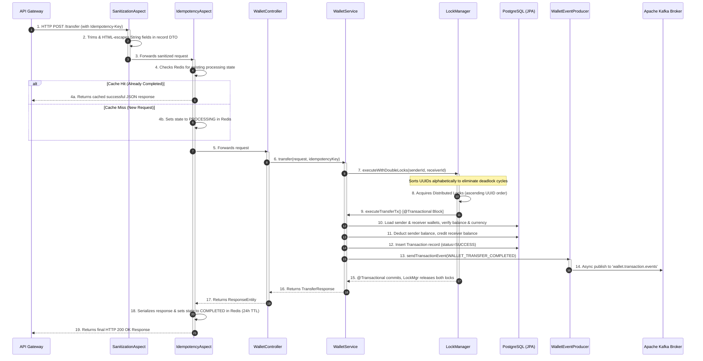

# Wallet Core Service Summary

The **Wallet Core** is the heart of the Flash-Wallet ecosystem. It is responsible for managing financial state, executing P2P transfers, processing deposits, and ensuring high-concurrency data consistency. It implements sophisticated distributed locking (using Redisson) to prevent race conditions during concurrent transactions and enforces strict API idempotency (via AOP and Redis) to avoid double-charging users on network retries.

## Design Flow: Which File Acts When?

Here is the lifecycle of a complex transaction (e.g., a P2P Transfer) within the `wallet-core` service.

### Flow: Idempotent P2P Transfer Pipeline

Below is an exhaustive breakdown of every file within the `wallet-core` service and its exact purpose.

## 1. Controller Layer (`controller/`)
- **`WalletController.java`**: Exposes REST endpoints (`/api/v1/wallets`). Methods like `/transfer` and `/deposit` are annotated with `@Idempotent` to trigger the idempotency aspect. It handles HTTP request mapping, passes `@Valid`-annotated Java `record` DTOs downstream, and returns `TransferResponse` or `WalletResponse`.

## 2. Idempotency & Sanitization Layer (`idempotency/`)
*Prevents users from being double-charged if their mobile app retries a transfer due to a network timeout, and cleanses inputs against XSS.*
- **`IdempotencyAspect.java`**: An AOP aspect that wraps methods annotated with `@Idempotent`. It intercepts the request, reads the `Idempotency-Key` header, and checks `IdempotencyService` (Redis). If it's a new request, it lets it proceed and caches the JSON response upon success. If it's a retry of an already completed request, it short-circuits and returns the cached JSON response directly, bypassing the controller entirely.
- **`SanitizationAspect.java`**: A post-validation AOP aspect that intercepts incoming controller parameters. It recursively scans Java record DTOs, trims whitespace, and HTML-escapes all string components using Spring's `HtmlUtils` to prevent XSS.
- **`IdempotencyService.java`**: Abstraction over Redis to store `IdempotencyState` with a Time-To-Live (TTL). Handles atomic state transitions (e.g., `tryStart`, `complete`, `fail`).
- **`IdempotencyState.java`**: DTO representing the state of an idempotent request in Redis (status, cached HTTP response body, HTTP status code).
- **`Idempotent.java`**: A custom marker annotation used on controller methods that require idempotency guarantees.

## 3. Distributed Lock Layer (`lock/`)
*Prevents race conditions (e.g., spending the same $10 twice simultaneously) across multiple instances of the service.*
- **`LockManager.java`**: Uses Redisson (Redis) to acquire distributed locks on Wallet IDs. It features `executeWithDoubleLocks` which smartly sorts the sender and receiver UUIDs alphabetically before locking them to categorically prevent distributed deadlocks between concurrent bidirectional transfers.
- **`LockCallback.java`**: A functional interface representing the code block (like a database transaction) to be executed while holding the lock(s).

## 4. Service Layer (`service/`)
- **`WalletService.java`**: The core business logic orchestrator.
  - **Transfers**: Calls `LockManager.executeWithDoubleLocks()` which acquires distributed Redisson locks on both wallet UUIDs in strictly ascending alphabetical order (preventing cyclical deadlock). Inside the lock, `executeTransferTx()` runs as a single `@Transactional` block: validates currencies, checks balance, debits sender, credits receiver, records a `Transaction` with status `SUCCESS`, and publishes a `WALLET_TRANSFER_COMPLETED` event to Kafka.
  - **Deposits**: Calls `LockManager.executeWithLock()` on the target wallet. Inside the lock, `executeDepositTx()` credits the wallet, records a `Transaction` with status `SUCCESS`, and publishes a `WALLET_DEPOSIT_COMPLETED` event to Kafka.
  - **Critical Design Choice**: Locks are acquired *outside* the JPA `@Transactional` boundary to prevent Hibernate dirty-read conflicts and database connection pool starvation. The `@Lazy` self-injection pattern is used to ensure Spring's transactional proxy is correctly applied on the internal `executeTransferTx` / `executeDepositTx` calls.

## 5. Event Producer Layer (`producer/`)
- **`WalletEventProducer.java`**: Uses `KafkaTemplate` to asynchronously publish `TransactionEvent` payloads to Kafka. It uses the `Transaction ID` as the Kafka routing key to ensure strict ordering of events per transaction.

## 6. Entity & Repository Layer (`model/` & `repository/`)
- **`Wallet.java`**: JPA entity mapping to the `wallets` table. Holds `balance` (BIGINT in lowest denomination), `currency` (VARCHAR 3-char ISO code), and a `@Version` field for Hibernate Optimistic Locking (secondary safety net beneath Redis locks).
- **`Transaction.java`**: JPA entity mapping to `transactions`. Records each completed operation with `idempotencyKey`, `senderWalletId`, `receiverWalletId`, `amount`, and a `TransactionStatus` enum (`SUCCESS` / `FAILED`). `senderWalletId` is nullable for external deposit operations.
- **`TransactionStatus.java`**: Enum with values `PENDING`, `SUCCESS`, `FAILED`.
- **`WalletRepository.java` & `TransactionRepository.java`**: Spring Data JPA interfaces for database CRUD operations.

## 7. Exception Layer (`exception/`)
- **`GlobalExceptionHandler.java`**: A `@ControllerAdvice` class that catches custom exceptions (like `InsufficientBalanceException`, `WalletNotFoundException`, `LockAcquisitionException`, or `IdempotencyConflictException`) and translates them into clean, standardized JSON HTTP error responses for the API Gateway.
- **`InsufficientBalanceException.java`, `WalletNotFoundException.java`, `LockAcquisitionException.java`, `IdempotencyConflictException.java`, `IdempotencyValidationException.java`**: Custom business exceptions representing specific failure states in the domain logic.

## 8. Configuration Layer (`config/`)
- **`RedissonConfig.java`**: Sets up the RedissonClient connection pool to Redis for distributed locking.
- **`KafkaConfig.java`**: Defines the Kafka `NewTopic` (`wallet.transaction.events`) ensuring the topic exists with proper partitions and replicas on application startup.
- **`JacksonSecurityConfig.java`**: Explicitly configures the global Spring Boot `ObjectMapper` to fail on unknown properties and disable default typing configurations to prevent polymorphic deserialization attacks.
- **`OpenApiConfig.java`**: Configures Swagger/OpenAPI documentation generation for the REST API.

## 9. Data Transfer Objects (`dto/` & `event/`)
- **`CreateWalletRequest.java`, `DepositRequest.java`, `TransferRequest.java`, `TransferResponse.java`, `WalletResponse.java`**: Immutable Java `record`s used for HTTP request/response serialization with Jackson, including `jakarta.validation` annotations (like `@NotNull`, `@Positive`) to enforce strict API contracts. `WalletResponse` intentionally omits the Hibernate `version` field to avoid leaking internal entity state.
- **`TransactionEvent.java`**: An immutable Java `record` implementing `Serializable`. It is the Kafka payload model published to `wallet.transaction.events`. Fields include `transactionId`, `idempotencyKey`, `senderWalletId` (nullable for deposits), `receiverWalletId`, `amount`, `currency`, `status`, `eventType`, and `timestamp`.

