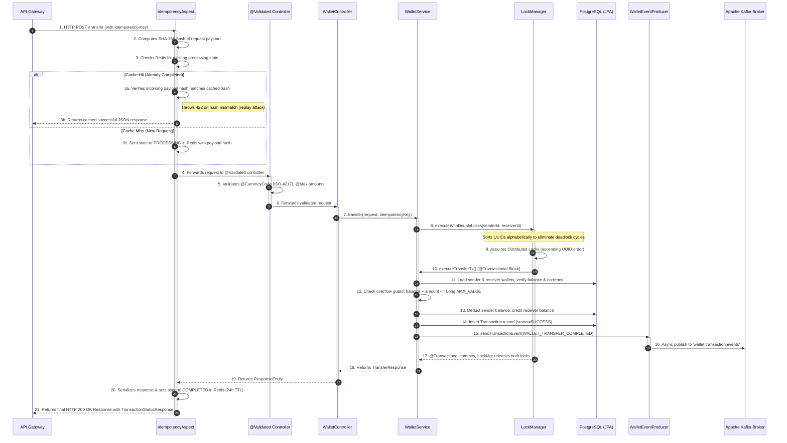
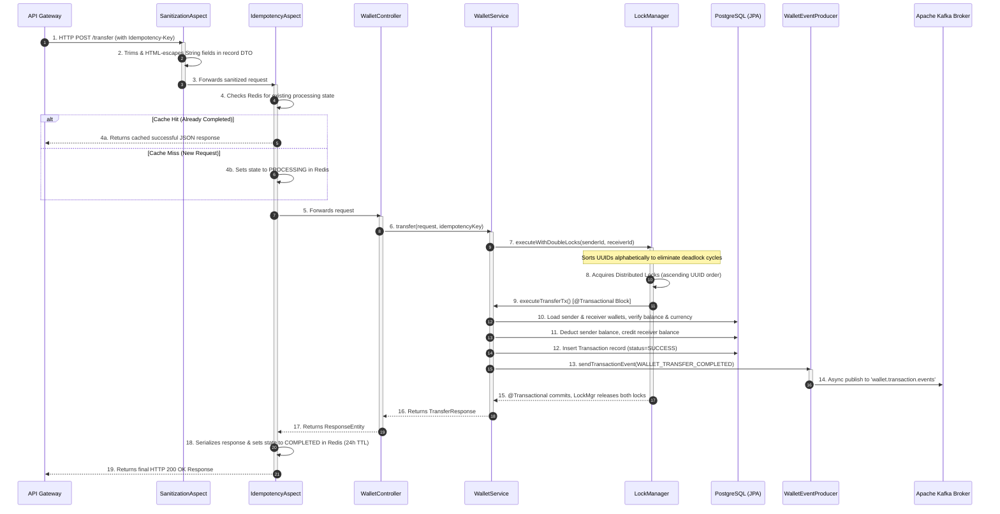

# Wallet Core Service Summary

The **Wallet Core** is the heart of the Flash-Wallet ecosystem. It is responsible for managing financial state, executing P2P transfers, processing deposits, and ensuring high-concurrency data consistency. It implements sophisticated distributed locking (using Redisson) to prevent race conditions during concurrent transactions and enforces strict API idempotency (via AOP and Redis) to avoid double-charging users on network retries.

## Design Flow: Which File Acts When?

Here is the lifecycle of a complex transaction (e.g., a P2P Transfer) within the `wallet-core` service.

### Flow: Idempotent P2P Transfer Pipeline

Below is an exhaustive breakdown of every file within the `wallet-core` service and its exact purpose.

## 1. Controller Layer (`controller/`)
- **`WalletController.java`**: Exposes REST endpoints (`/api/v1/wallets`). Annotated with `@Validated` to enable method-level constraint validation. Methods like `/transfer` and `/deposit` are annotated with `@Idempotent` to trigger the idempotency aspect. It handles HTTP request mapping, passes `@Valid`-annotated Java `record` DTOs downstream, and returns strongly-typed responses (`TransferResponse`, `WalletResponse`, `TransactionStatusResponse`).

## 2. Idempotency Layer (`idempotency/`)
*Prevents users from being double-charged if their mobile app retries a transfer due to a network timeout. Binds idempotency keys to payload hashes to prevent replay attacks.*
- **`IdempotencyAspect.java`**: An AOP aspect that wraps methods annotated with `@Idempotent`. It intercepts the request, reads the `Idempotency-Key` header, computes SHA-256 hash of the request payload, and checks `IdempotencyService` (Redis). On a new request, it stores both the idempotency state and payload hash. On a retry, it verifies the incoming payload hash matches the stored hash; if they differ, it throws `IdempotencyPayloadMismatchException` (422 Unprocessable Entity) to prevent replay attacks with mutated payloads. If the hash matches and the request already succeeded, it short-circuits and returns the cached JSON response directly.
- **`IdempotencyService.java`**: Abstraction over Redis to store `IdempotencyState` with a Time-To-Live (TTL). Handles atomic state transitions (e.g., `tryStart`, `complete`, `fail`), now accepting `payloadHash` parameter to bind idempotency keys to specific request bodies.
- **`IdempotencyState.java`**: DTO representing the state of an idempotent request in Redis (status, cached HTTP response body, HTTP status code, and `payloadHash` for replay-attack prevention).
- **`Idempotent.java`**: A custom marker annotation used on controller methods that require idempotency guarantees.

## 3. Distributed Lock Layer (`lock/`)
*Prevents race conditions (e.g., spending the same $10 twice simultaneously) across multiple instances of the service.*
- **`LockManager.java`**: Uses Redisson (Redis) to acquire distributed locks on Wallet IDs. It features `executeWithDoubleLocks` which smartly sorts the sender and receiver UUIDs alphabetically before locking them to categorically prevent distributed deadlocks between concurrent bidirectional transfers.
- **`LockCallback.java`**: A functional interface representing the code block (like a database transaction) to be executed while holding the lock(s).

## 4. Service Layer (`service/`)
- **`WalletService.java`**: The core business logic orchestrator.
  - **Transfers**: Calls `LockManager.executeWithDoubleLocks()` which acquires distributed Redisson locks on both wallet UUIDs in strictly ascending alphabetical order (preventing cyclical deadlock). Inside the lock, `executeTransferTx()` runs as a single `@Transactional` block: validates currencies (with `Locale.ROOT` for locale-safe normalization), checks balance, includes an arithmetic overflow guard (`if (balance > Long.MAX_VALUE - amount)`), debits sender, credits receiver, records a `Transaction` with status `SUCCESS`, and publishes a `WALLET_TRANSFER_COMPLETED` event to Kafka.
  - **Deposits**: Calls `LockManager.executeWithLock()` on the target wallet. Inside the lock, `executeDepositTx()` credits the wallet, includes an overflow guard before adding amount, records a `Transaction` with status `SUCCESS`, and publishes a `WALLET_DEPOSIT_COMPLETED` event to Kafka.
  - **Critical Design Choice**: Locks are acquired *outside* the JPA `@Transactional` boundary to prevent Hibernate dirty-read conflicts and database connection pool starvation. The `@Lazy` self-injection pattern is used to ensure Spring's transactional proxy is correctly applied on the internal `executeTransferTx` / `executeDepositTx` calls.

## 5. Event Producer Layer (`producer/`)
- **`WalletEventProducer.java`**: Uses `KafkaTemplate` to asynchronously publish `TransactionEvent` payloads to Kafka. It uses the `Transaction ID` as the Kafka routing key to ensure strict ordering of events per transaction.

## 6. Entity & Repository Layer (`model/` & `repository/`)
- **`Wallet.java`**: JPA entity mapping to the `wallets` table. Holds `balance` (BIGINT in lowest denomination), `currency` (VARCHAR 3-char ISO code), and a `@Version` field for Hibernate Optimistic Locking (secondary safety net beneath Redis locks). Uses explicit `@Getter`, `@Setter`, `@ToString`, `@EqualsAndHashCode(of = "id")` to fix the common JPA anti-pattern of `@Data` which incorrectly includes all lazy-loaded fields in equals/hashCode, causing issues with lazy-loaded collections and version fields.
- **`Transaction.java`**: JPA entity mapping to `transactions`. Records each completed operation with `idempotencyKey`, `senderWalletId`, `receiverWalletId`, `amount`, and a `TransactionStatus` enum (`SUCCESS` / `FAILED`). `senderWalletId` is nullable for external deposit operations. Uses the same explicit Lombok annotations to ensure correct equals/hashCode behavior.
- **`TransactionStatus.java`**: Enum with values `PENDING`, `SUCCESS`, `FAILED`.
- **`WalletRepository.java` & `TransactionRepository.java`**: Spring Data JPA interfaces for database CRUD operations.

## 7. Exception Layer (`exception/`)
- **`GlobalExceptionHandler.java`**: A `@ControllerAdvice` class that catches and translates exceptions into clean, standardized JSON HTTP error responses:
  - Custom domain exceptions (`InsufficientBalanceException`, `WalletNotFoundException`, `LockAcquisitionException`, `IdempotencyConflictException`, `IdempotencyValidationException`) map to semantically appropriate HTTP status codes.
  - **`DataIntegrityViolationException`** from the database layer is caught and transformed: if the root cause mentions `idempotency_key` or `user_id` constraint violations, it returns 409 Conflict (duplicate wallet or idempotency key already processed).
  - **`IdempotencyPayloadMismatchException`** returns 422 Unprocessable Entity when a request is replayed with a different payload hash.
- **`IdempotencyPayloadMismatchException.java`**: Custom exception thrown when a retry of a completed request carries a different request payload, indicating a malicious replay attempt or client error.

## 8. Configuration Layer (`config/`)
- **`RedissonConfig.java`**: Sets up the RedissonClient connection pool to Redis for distributed locking.
- **`KafkaConfig.java`**: Defines the Kafka `NewTopic` (`wallet.transaction.events`) ensuring the topic exists with proper partitions and replicas on application startup.
- **`JacksonSecurityConfig.java`**: Explicitly configures the global Spring Boot `ObjectMapper` to fail on unknown properties and disable default typing configurations to prevent polymorphic deserialization attacks.
- **`OpenApiConfig.java`**: Configures Swagger/OpenAPI documentation generation for the REST API.

## 9. Data Transfer Objects (`dto/` & `event/`)
- **Input DTOs** (`CreateWalletRequest.java`, `DepositRequest.java`, `TransferRequest.java`): Immutable Java `record`s enforcing strict validation:
  - **Amount validation**: `@Max(1_000_000_000_000L)` prevents integer overflow attempts. Service layer adds secondary arithmetic overflow guards before performing `balance + amount` calculations.
  - **Currency validation**: Custom `@CurrencyCode` JSR-380 constraint validates 3-letter ISO-4217 currency codes via `java.util.Currency.getInstance()`, replacing naive `@Size(min=3,max=3)` checks. Normalizes to uppercase via `Locale.ROOT` for locale-safety.
- **Response DTOs** (`TransferResponse.java`, `WalletResponse.java`, `TransactionStatusResponse.java`): Immutable Java `record`s returned by the API. `WalletResponse` intentionally omits the Hibernate `version` field to avoid leaking internal entity state. **`TransactionStatusResponse`** (new) is a typed record (`record TransactionStatusResponse(UUID transactionId, String status)`) that replaces untyped `Map<String, String>` responses for transaction status polling.
- **Validation Annotations** (`CurrencyCode.java`, `CurrencyCodeValidator.java`): Custom JSR-380 constraint and validator for ISO-4217 currency codes, providing compile-time safety and clear error messages.
- **`TransactionEvent.java`**: An immutable Java `record` implementing `Serializable`. It is the Kafka payload model published to `wallet.transaction.events`. Fields include `transactionId`, `idempotencyKey`, `senderWalletId` (nullable for deposits), `receiverWalletId`, `amount`, `currency`, `status`, `eventType`, and `timestamp`.

---

## Phase 1 & 2 Hardening Improvements (Commit: bb16e8a)

### Phase 1: Data Integrity & Idempotency Hardening

**Goal**: Eliminate idempotency and concurrency vulnerabilities by binding idempotency keys to request payloads and fixing JPA entity design anti-patterns.

1. **Payload Hash Binding for Idempotency Keys**
   - **Changed files**: `IdempotencyAspect.java`, `IdempotencyService.java`, `IdempotencyState.java`
   - **What**: Idempotency keys are now bound to SHA-256 hashes of the request body. On retry, if the payload differs, a 422 response is returned instead of a cached response.
   - **Why**: Prevents replay attacks where a user might alter the amount and retry the same idempotency key.
   - **New exception**: `IdempotencyPayloadMismatchException.java` → 422 Unprocessable Entity.

2. **Database Constraint Violation Handling**
   - **Changed files**: `GlobalExceptionHandler.java`
   - **What**: `DataIntegrityViolationException` is now caught and inspected for constraint names. If `idempotency_key` or `user_id` constraints are violated, a 409 Conflict is returned instead of a generic 500.
   - **Why**: Gives clients proper feedback on duplicate wallet creation or idempotency key collisions.

3. **JPA Entity Anti-Pattern Fix**
   - **Changed files**: `Wallet.java`, `Transaction.java`
   - **What**: Replaced `@Data` with explicit `@Getter`, `@Setter`, `@ToString`, `@EqualsAndHashCode(of = "id")`.
   - **Why**: `@Data` incorrectly includes lazy-loaded relationships and versioning fields in equals/hashCode, breaking JPA identity semantics and causing Hibernate proxy comparison bugs.

### Phase 2: Input Validation Tightening

**Goal**: Enforce strict input validation at the API boundary to prevent arithmetic overflow, invalid currency codes, and type confusion.

1. **Arithmetic Overflow Prevention**
   - **Changed files**: `TransferRequest.java`, `DepositRequest.java`, `WalletService.java`, `TransferSagaConsumer.java`
   - **What**: 
     - DTOs now include `@Max(1_000_000_000_000L)` on amount fields.
     - Service methods add runtime overflow guards: `if (wallet.getBalance() > Long.MAX_VALUE - request.amount())` before arithmetic.
   - **Why**: Prevents integer wrapping attacks that could credit accounts beyond intended limits.

2. **ISO-4217 Currency Code Validation**
   - **Changed files**: `CurrencyCode.java` (NEW), `CurrencyCodeValidator.java` (NEW), `CreateWalletRequest.java`, `DepositRequest.java`, `TransferRequest.java`
   - **What**: Custom `@CurrencyCode` JSR-380 validator replaces naive `@Size(min=3,max=3)`. Validates codes via `java.util.Currency.getInstance()`.
   - **Why**: Rejects invalid/non-existent currency codes early and provides clear error messages.

3. **Locale-Safe Currency Normalization**
   - **Changed files**: `WalletService.java`
   - **What**: Changed `currency.toUpperCase()` to `currency.toUpperCase(Locale.ROOT)` in `createWallet()`.
   - **Why**: Prevents locale-specific uppercase rules (e.g., Turkish 'i' → 'İ') from causing currency matching bugs.

4. **Type-Safe Response DTOs**
   - **Changed files**: `TransactionStatusResponse.java` (NEW), `WalletController.java`
   - **What**: New `TransactionStatusResponse` record replaces `Map<String, String>` in transaction status polling endpoint.
   - **Why**: Provides compile-time type safety and prevents accidental field leakage.

5. **Controller Validation Activation**
   - **Changed files**: `WalletController.java`
   - **What**: Added `@Validated` class-level annotation to activate method-level constraint validation.
   - **Why**: Ensures JSR-380 violations are caught at the controller boundary, not buried in service logic.

6. **Removal of Output Sanitization**
   - **Deleted**: `SanitizationAspect.java`
   - **Why**: HTML-escaping on the service layer corrupts stored data for non-HTML consumers (e.g., mobile apps, other microservices). Sanitization should occur at the presentation layer (API Gateway / frontend), not in the core service.

---

## Build & Deployment Notes

- **Java**: Requires JDK 21+ (records, pattern matching)
- **Maven**: Multi-module build. Build wallet-core with `mvn clean install` from `flash-wallet/` directory.
- **Database**: Runs schema migrations on `wallet_core_db` PostgreSQL database.
- **Redis**: Required for distributed locking and idempotency caching.
- **Kafka**: Requires `wallet.transaction.events` topic (auto-created by `KafkaConfig`).
- **Docker**: Provided in [docker-compose.yml](../docker-compose.yml) at project root.
# Wallet Core Service Summary

The **Wallet Core** is the heart of the Flash-Wallet ecosystem. It is responsible for managing financial state, executing P2P transfers, processing deposits, and ensuring high-concurrency data consistency. It implements sophisticated distributed locking (using Redisson) to prevent race conditions during concurrent transactions and enforces strict API idempotency (via AOP and Redis) to avoid double-charging users on network retries.

## Design Flow: Which File Acts When?

Here is the lifecycle of a complex transaction (e.g., a P2P Transfer) within the `wallet-core` service.

### Flow: Idempotent P2P Transfer Pipeline

Below is an exhaustive breakdown of every file within the `wallet-core` service and its exact purpose.

## 1. Controller Layer (`controller/`)
- **`WalletController.java`**: Exposes REST endpoints (`/api/v1/wallets`). Methods like `/transfer` and `/deposit` are annotated with `@Idempotent` to trigger the idempotency aspect. It handles HTTP request mapping, passes `@Valid`-annotated Java `record` DTOs downstream, and returns `TransferResponse` or `WalletResponse`.

## 2. Idempotency & Sanitization Layer (`idempotency/`)
*Prevents users from being double-charged if their mobile app retries a transfer due to a network timeout.*
- **`IdempotencyAspect.java`**: An AOP aspect that wraps methods annotated with `@Idempotent`. It intercepts the request, reads the `Idempotency-Key` header, and checks `IdempotencyService` (Redis). On a new request, it computes a SHA-256 hash of the request payload and stores it with the idempotency state. On a retry, it verifies the incoming payload hash matches the stored hash; if they differ, it throws `IdempotencyPayloadMismatchException` (422 Unprocessable Entity) to prevent replay attacks with mutated payloads. If the hash matches and the request already succeeded, it short-circuits and returns the cached JSON response directly.
- **`IdempotencyService.java`**: Abstraction over Redis to store `IdempotencyState` with a Time-To-Live (TTL). Handles atomic state transitions (e.g., `tryStart`, `complete`, `fail`), now accepting `payloadHash` to bind idempotency keys to specific request bodies.
- **`IdempotencyState.java`**: DTO representing the state of an idempotent request in Redis (status, cached HTTP response body, HTTP status code, and `payloadHash` for replay-attack prevention).
- **`Idempotent.java`**: A custom marker annotation used on controller methods that require idempotency guarantees.

## 3. Distributed Lock Layer (`lock/`)
*Prevents race conditions (e.g., spending the same $10 twice simultaneously) across multiple instances of the service.*
- **`LockManager.java`**: Uses Redisson (Redis) to acquire distributed locks on Wallet IDs. It features `executeWithDoubleLocks` which smartly sorts the sender and receiver UUIDs alphabetically before locking them to categorically prevent distributed deadlocks between concurrent bidirectional transfers.
- **`LockCallback.java`**: A functional interface representing the code block (like a database transaction) to be executed while holding the lock(s).

## 4. Service Layer (`service/`)
- **`WalletService.java`**: The core business logic orchestrator.
  - **Transfers**: Calls `LockManager.executeWithDoubleLocks()` which acquires distributed Redisson locks on both wallet UUIDs in strictly ascending alphabetical order (preventing cyclical deadlock). Inside the lock, `executeTransferTx()` runs as a single `@Transactional` block: validates currencies, checks balance, debits sender, credits receiver, records a `Transaction` with status `SUCCESS`, and publishes a `WALLET_TRANSFER_COMPLETED` event to Kafka.
  - **Deposits**: Calls `LockManager.executeWithLock()` on the target wallet. Inside the lock, `executeDepositTx()` credits the wallet, records a `Transaction` with status `SUCCESS`, and publishes a `WALLET_DEPOSIT_COMPLETED` event to Kafka.
  - **Critical Design Choice**: Locks are acquired *outside* the JPA `@Transactional` boundary to prevent Hibernate dirty-read conflicts and database connection pool starvation. The `@Lazy` self-injection pattern is used to ensure Spring's transactional proxy is correctly applied on the internal `executeTransferTx` / `executeDepositTx` calls.

## 5. Event Producer Layer (`producer/`)
- **`WalletEventProducer.java`**: Uses `KafkaTemplate` to asynchronously publish `TransactionEvent` payloads to Kafka. It uses the `Transaction ID` as the Kafka routing key to ensure strict ordering of events per transaction.

## 6. Entity & Repository Layer (`model/` & `repository/`)
 
 **`Wallet.java`**: JPA entity mapping to the `wallets` table. Holds `balance` (BIGINT in lowest denomination), `currency` (VARCHAR 3-char ISO code), and a `@Version` field for Hibernate Optimistic Locking (secondary safety net beneath Redis locks). Uses explicit `@Getter`, `@Setter`, `@ToString`, `@EqualsAndHashCode(of = "id")` to fix the common JPA anti-pattern of `@Data` which incorrectly includes all lazy-loaded fields in equals/hashCode.
 **`Transaction.java`**: JPA entity mapping to `transactions`. Records each completed operation with `idempotencyKey`, `senderWalletId`, `receiverWalletId`, `amount`, and a `TransactionStatus` enum (`SUCCESS` / `FAILED`). `senderWalletId` is nullable for external deposit operations. Uses the same explicit Lombok annotations to ensure correct equals/hashCode behavior.

## 7. Exception Layer (`exception/`)

## 8. Configuration Layer (`config/`)
- **`RedissonConfig.java`**: Sets up the RedissonClient connection pool to Redis for distributed locking.
- **`KafkaConfig.java`**: Defines the Kafka `NewTopic` (`wallet.transaction.events`) ensuring the topic exists with proper partitions and replicas on application startup.
- **`JacksonSecurityConfig.java`**: Explicitly configures the global Spring Boot `ObjectMapper` to fail on unknown properties and disable default typing configurations to prevent polymorphic deserialization attacks.
- **`OpenApiConfig.java`**: Configures Swagger/OpenAPI documentation generation for the REST API.

## 9. Data Transfer Objects (`dto/` & `event/`)
- **`CreateWalletRequest.java`, `DepositRequest.java`, `TransferRequest.java`, `TransferResponse.java`, `WalletResponse.java`**: Immutable Java `record`s used for HTTP request/response serialization with Jackson, including `jakarta.validation` annotations (like `@NotNull`, `@Positive`) to enforce strict API contracts. `WalletResponse` intentionally omits the Hibernate `version` field to avoid leaking internal entity state.
- **`TransactionEvent.java`**: An immutable Java `record` implementing `Serializable`. It is the Kafka payload model published to `wallet.transaction.events`. Fields include `transactionId`, `idempotencyKey`, `senderWalletId` (nullable for deposits), `receiverWalletId`, `amount`, `currency`, `status`, `eventType`, and `timestamp`.

