# ⚡ Flash-Wallet Ledger: High-Throughput Distributed Microservices

Flash-Wallet Ledger is a production-ready, high-performance digital wallet microservices system designed for low-latency concurrent transaction processing with absolute data integrity. 

This architecture bypasses traditional, heavy enterprise patterns (like Eureka) in favor of modern container-native networking and focuses on solving the hard problems of transaction processing: **atomic idempotency, deadlock-free distributed locks, event streaming, and resilient audit logging**.

---

## 🏗️ System Architecture

```
                  [ Client / API Consumer ]
                             │
                             │  Authorization: Bearer <JWT>
                             ▼
                     [ Keycloak IAM ]
                     (JWT Issuer & RBAC)
                             │
                             │  JWT validated by Gateway
                             ▼
                [ flash-api-gateway (Port 8080) ]
                   (OAuth2 Resource Server)
                     │                  │
                     │ X-User-Id        │ X-User-Id
                     │ X-User-Roles     │ X-User-Roles
                     │ X-User-Scopes    │ X-User-Scopes
                     │ (JWT stripped)   │ (JWT stripped)
                     ▼                  ▼
            [ flash-wallet-core ]   [ flash-audit-worker ]
             │         │    ▲        (GET /api/v1/audit/**)
             ▼ (SETNX) │    │ (Consume)      │
         [ Redis ]     │    └───────┐         ▼ (Append-Only + Query)
             │         ▼            │    [ Audit DB + Redis Cache ]
             │    [ Wallet Core DB ]│
             │                      │
             └─────────────► [ Kafka Topics ]
                          - wallet.saga.events (Saga)
                          - wallet.transaction.events (Audit)
                                     │
                                     ▼ (Async Kafka Consumer — NOT via Gateway)
                          [ flash-audit-worker ]
                                     │
                                     ▼ (Append-Only)
                                [ Audit DB ]
```

### Core Flow Sequence Diagram

```mermaid
sequenceDiagram
    autonumber
    actor Client
    participant Gateway as flash-api-gateway
    participant Redis as Redis Cache
    participant Core as flash-wallet-core
    participant DB as Postgres (Core DB)
    participant KafkaSaga as Kafka (wallet.saga.events)
    participant KafkaAudit as Kafka (wallet.transaction.events)
    participant Worker as flash-audit-worker
    participant AuditDB as Postgres (Audit DB)

    Note over Client,Gateway: Step 1: Synchronous Debit & Saga Initiation
    Client->>Gateway: POST /api/v1/wallets/transfer (Idempotency-Key, Payload)
    Note over Gateway: OAuth2 Resource Server validates JWT (Keycloak issuer)<br/>KeyCloakRoleConverter extracts ROLE_* + SCOPE_* authorities<br/>SecurityConfig enforces role-based route access<br/>CorrelationIdFilter generates X-Request-Id<br/>ContentTypeValidationFilter rejects non-JSON mutating requests (415)<br/>IdempotencyHeaderValidationFilter verifies UUID + 128-char length cap<br/>UserContextPropagationFilter strips JWT, injects X-User-Id/Roles/Scopes<br/>Method allowlist rejects TRACE/CONNECT/OPTIONS (404)<br/>RateLimiterFilter checks per-client quota (externalized config)<br/>RequestSizeFilter rejects payloads > 10 KB<br/>CircuitBreaker short-circuits if wallet-core is failing (503 fallback)<br/>Retry filter retries GET on 5xx (max 2, jittered backoff)<br/>SecurityHeadersFilter (WebFilter) injects nosniff/DENY/no-referrer/HSTS via beforeCommit()
    Gateway->>Core: Forwarded Request (X-User-Id, X-User-Roles, X-User-Scopes — no JWT)
    
    rect rgb(25, 25, 35)
        Note over Core: IdempotencyAspect intercepts request & computes SHA-256 payload hash
        Core->>Redis: setIfAbsent(idempotency:KEY, "PROCESSING", TTL=5m)
        alt Key Already exists (Conflict / Replay)
            Redis-->>Core: false
            Core->>Redis: get(idempotency:KEY)
            Redis-->>Core: IdempotencyState (COMPLETED / PROCESSING)
            Core-->>Gateway: Return Cached Response / 409 Conflict
            Gateway-->>Client: Response
        else Key successfully registered
            Redis-->>Core: true
        end
    end

    rect rgb(35, 25, 25)
        Note over Core: LockManager locks SENDER wallet
        Core->>Redis: tryLock(lock:wallet:SENDER)
        Note over Core: Sender lock acquired. Start @Transactional block
        Core->>DB: Load sender wallet & validate balance/currency
        Core->>DB: Insert transaction record (status=INITIATED)
        Core->>DB: Debit sender balance
        Core->>DB: Update transaction status to DEBIT_COMPLETED
        Core->>KafkaSaga: Publish TRANSFER_DEBIT_COMPLETED event
        Core-->>DB: Commit Database Transaction
        Core->>Redis: unlock(lock:wallet:SENDER)
    end

    Core->>Redis: complete(idempotency:KEY, responseBody, 202 Accepted, TTL=24h)
    Core-->>Gateway: HTTP 202 Accepted (Status: DEBIT_COMPLETED)
    Gateway-->>Client: HTTP 202 Accepted (with headers X-Request-Id)

    Note over Client,Gateway: Step 2: Asynchronous Saga Execution (Credit / Compensate)
    KafkaSaga->>Core: Consume TRANSFER_DEBIT_COMPLETED (TransferSagaConsumer)
    
    alt Happy Path: Credit Receiver
        rect rgb(25, 35, 25)
            Note over Core: LockManager locks RECEIVER wallet
            Core->>Redis: tryLock(lock:wallet:RECEIVER)
            Core->>DB: Load receiver wallet & validate currency
            Core->>DB: Credit receiver balance
            Core->>DB: Update transaction status to COMPLETED
            Core->>KafkaAudit: Publish WALLET_TRANSFER_COMPLETED event
            Core-->>DB: Commit Transaction
            Core->>Redis: unlock(lock:wallet:RECEIVER)
        end
    else Failure Path: Compensating Transaction (e.g., Receiver not found / Currency mismatch)
        rect rgb(45, 25, 25)
            Note over Core: LockManager locks SENDER wallet
            Core->>Redis: tryLock(lock:wallet:SENDER)
            Core->>DB: Re-credit sender balance (Refund)
            Core->>DB: Update transaction status to COMPENSATED
            Core->>KafkaAudit: Publish WALLET_TRANSFER_SAGA_FAILED event
            Core-->>DB: Commit Transaction
            Core->>Redis: unlock(lock:wallet:SENDER)
        end
    end

    opt Asynchronous Audit Logging
        KafkaAudit->>Worker: Consume events (WALLET_TRANSFER_COMPLETED / WALLET_TRANSFER_SAGA_FAILED / WALLET_DEPOSIT_COMPLETED)
        Worker->>Worker: Validate message properties & deserialize
        alt Validation Success
            Worker->>AuditDB: Persist AuditLog (JSONB payload, partition, offset)
        else Validation fails / Database error
            Note over Worker: Retries exhausted
            Worker->>KafkaAudit: Publish to wallet.transaction.events.DLT
            Worker->>AuditDB: Log failure in audit_processing_failures
        end
    end
```



### Security & Authorization Flow

```mermaid
sequenceDiagram
    autonumber
    actor Client
    participant Keycloak as Keycloak IAM
    participant Gateway as flash-api-gateway
    participant Core as flash-wallet-core
    participant AuditAPI as flash-audit-worker (Query API)

    Note over Client,Keycloak: Step 0: Obtain JWT from Keycloak
    Client->>Keycloak: POST /realms/master/protocol/openid-connect/token (credentials)
    Keycloak-->>Client: JWT (sub=userId, realm_access.roles=[CUSTOMER], scope=wallet:read wallet:write ...)

    Note over Client,Gateway: Step 1: Authenticated Request to Gateway
    Client->>Gateway: POST /api/v1/wallets/transfer (Authorization: Bearer JWT)

    rect rgb(25, 30, 45)
        Note over Gateway: Layer 1 — Perimeter Authentication & Authorization
        Gateway->>Gateway: Validate JWT signature & issuer (Keycloak JWKS)
        Gateway->>Gateway: KeyCloakRoleConverter extracts ROLE_CUSTOMER + SCOPE_wallet:write
        Gateway->>Gateway: SecurityConfig checks hasAnyRole(CUSTOMER, SERVICE_CLIENT) — ✅ Pass
        Gateway->>Gateway: UserContextPropagationFilter strips JWT, injects headers
    end

    Gateway->>Core: Forwarded Request (X-User-Id: uuid, X-User-Roles: CUSTOMER, X-User-Scopes: wallet:read,wallet:write)

    rect rgb(25, 35, 30)
        Note over Core: Layer 2 — Trusted Header Authentication
        Core->>Core: TrustedHeaderAuthenticationFilter reconstructs Authentication (principal=userId, authorities=[ROLE_CUSTOMER, SCOPE_wallet:write])
    end

    rect rgb(35, 30, 25)
        Note over Core: Layer 3 — Method-Level Authorization (@PreAuthorize)
        Core->>Core: Check: hasAuthority(SCOPE_internal:debit)? ❌ No
        Core->>Core: Check: hasAuthority(SCOPE_wallet:write)? ✅ Yes
        Core->>Core: WalletOwnershipGuard.assertWalletOwnership(walletId, auth)
        Core->>Core: Verify wallet.userId == auth.getName() (X-User-Id) — ✅ Owner
    end

    Core-->>Gateway: HTTP 202 Accepted
    Gateway-->>Client: HTTP 202 Accepted

    Note over Client,AuditAPI: Audit Query (ADMIN/AUDITOR only)
    Client->>Gateway: GET /api/v1/audit?transactionId=... (Authorization: Bearer JWT)
    Gateway->>Gateway: SecurityConfig checks hasAnyRole(ADMIN, AUDITOR) — ✅
    Gateway->>AuditAPI: Forwarded Request (X-User-Id, X-User-Roles: ADMIN)
    AuditAPI-->>Gateway: Paginated audit logs (Redis-cached)
    Gateway-->>Client: HTTP 200 OK
```



---

## 🛠️ Tech Stack & Infrastructure

* **Backend Engine:** Java 21 / Spring Boot 4.0.6
* **Identity & Access Management:** Keycloak (OAuth2/OpenID Connect — JWT-based authentication & RBAC)
* **Message Broker:** Apache Kafka 4.x / KRaft mode (Event-driven asynchronous audit engine)
* **Distributed Cache & Locking:** Redis (Redisson client for distributed locks, idempotency storage, and audit query caching)
* **Primary Relational Databases:** PostgreSQL (Isolated databases following Database-per-Service pattern)
* **Container Orchestration:** Docker & Docker Compose

---

## 📂 Project Structure & Microservices

The backend codebase is organized as a Maven multi-module project (defined in [pom.xml](file:///c:/Users/parth/Flash-Wallet/flash-wallet/pom.xml)):

| Microservice | Port | Description | Configuration File |
| :--- | :--- | :--- | :--- |
| **[api-gateway](file:///c:/Users/parth/Flash-Wallet/flash-wallet/api-gateway)** | `8080` | Perimeter API Gateway using Spring Cloud Gateway. Acts as an **OAuth2 Resource Server** validating Keycloak JWTs. Enforces role-based route authorization via [SecurityConfig](file:///c:/Users/parth/Flash-Wallet/flash-wallet/api-gateway/src/main/java/com/services/security/SecurityConfig.java), propagates user identity downstream via [UserContextPropagationFilter](file:///c:/Users/parth/Flash-Wallet/flash-wallet/api-gateway/src/main/java/com/services/apigateway/filter/UserContextPropagationFilter.java) (`X-User-Id`, `X-User-Roles`, `X-User-Scopes` headers — JWT stripped before forwarding). Routes to both wallet-core and audit-worker with isolated circuit breakers. Also enforces CORS, rate limiting, 10 KB request size limits, Content-Type validation, method allowlisting, Idempotency-Key validation, security response headers, bounded retry, correlation trace IDs, and Prometheus metrics. | [application.yml](file:///c:/Users/parth/Flash-Wallet/flash-wallet/api-gateway/src/main/resources/application.yml) |
| **[wallet-core](file:///c:/Users/parth/Flash-Wallet/flash-wallet/wallet-core)** | `8081` | Core Domain Service. Secured via [TrustedHeaderAuthenticationFilter](file:///c:/Users/parth/Flash-Wallet/flash-wallet/wallet-core/src/main/java/com/services/wallet/filter/TrustedHeaderAuthenticationFilter.java) that reconstructs `Authentication` from gateway-propagated headers. Uses `@PreAuthorize` with scope-based authorization and [WalletOwnershipGuard](file:///c:/Users/parth/Flash-Wallet/flash-wallet/wallet-core/src/main/java/com/services/wallet/service/WalletOwnershipGuard.java) for ownership enforcement. Manages wallets, executes transfers via choreography-based saga, enforces payload-bound idempotency with SHA-256 hashing, validates ISO-4217 currency codes, and publishes transaction events to Kafka. | [application.yml](file:///c:/Users/parth/Flash-Wallet/flash-wallet/wallet-core/src/main/resources/application.yml) |
| **[audit-worker](file:///c:/Users/parth/Flash-Wallet/flash-wallet/audit-worker)** | `8082` | Compliance Audit Service. Now exposed via gateway HTTP route (`GET /api/v1/audit/**`) for querying audit logs and processing failures (ADMIN/AUDITOR roles only). Secured via [TrustedHeaderAuthenticationFilter](file:///c:/Users/parth/Flash-Wallet/flash-wallet/audit-worker/src/main/java/com/services/auditworker/filter/TrustedHeaderAuthenticationFilter.java). Includes Redis-backed caching (60s TTL) for query performance. Also consumes events asynchronously from Kafka, validates with strict Jackson deserialization, stores logs in JSONB format, and handles dead-letter recoveries. | [application.yml](file:///c:/Users/parth/Flash-Wallet/flash-wallet/audit-worker/src/main/resources/application.yml) |

---

## ⚡ Key Engineering Design Patterns

### 1. High-Performance Currency Storage
To avoid IEEE 754 floating-point rounding errors, all financial balances are stored as **`BIGINT`** representing the absolute lowest denominator (e.g. Paisa/Cents). 
* ₹150.75 is stored strictly as `15075`.
* The presentation layer is responsible for scaling this value back on the UI.
* See [Wallet.java](file:///c:/Users/parth/Flash-Wallet/flash-wallet/wallet-core/src/main/java/com/services/wallet/model/Wallet.java) and [Transaction.java](file:///c:/Users/parth/Flash-Wallet/flash-wallet/wallet-core/src/main/java/com/services/wallet/model/Transaction.java).

### 2. Double-Click Protection & Payload-Bound Idempotency
Every mutating API request (Deposit, Transfer) requires an `Idempotency-Key` UUID header.
* The [IdempotencyHeaderValidationFilter](file:///c:/Users/parth/Flash-Wallet/flash-wallet/api-gateway/src/main/java/com/services/apigateway/filter/IdempotencyHeaderValidationFilter.java) at the Gateway validates header formats.
* In [wallet-core](file:///c:/Users/parth/Flash-Wallet/flash-wallet/wallet-core), the custom annotation `@Idempotent` is intercepted by [IdempotencyAspect](file:///c:/Users/parth/Flash-Wallet/flash-wallet/wallet-core/src/main/java/com/services/wallet/idempotency/IdempotencyAspect.java).
* On first request, it computes a SHA-256 hash of the request payload and stores it alongside the idempotency state in Redis with a `PROCESSING` status and a 5-minute guard TTL.
* If a concurrent request arrives before completion, it receives a `409 Conflict`.
* Once completed, the final response payload is saved in Redis under `COMPLETED` status with a 24-hour TTL, allowing immediate replay returns.
* On retry with an existing key, the aspect verifies the incoming payload hash matches the stored hash. If they differ, a `422 Unprocessable Entity` is returned to prevent replay attacks with mutated payloads.
* If the underlying database transaction fails, the aspect catches the exception and calls `idempotencyService.fail(key)` to remove the Redis key, allowing the client to safely retry.

### 3. Distributed Concurrency & Deadlock Prevention (Decoupled Locking)
In traditional peer-to-peer transfers, locking both the sender and receiver wallets concurrently can lead to complex cyclical deadlocks (e.g., if User A pays User B while User B concurrently pays User A).
* With the **Choreography-based Saga pattern**, we naturally eliminate cyclical deadlocks by decoupling lock acquisitions across time and steps.
* **Step 1 (Debit)**: Only the sender's wallet is locked. The lock is released immediately after Step 1 commits.
* **Step 2 (Credit)**: Only the receiver's wallet is locked when the saga consumer applies the credit.
* **Step 3 (Compensation)**: Only the sender's wallet is locked during the refund process.
* Since only a single wallet lock is held per execution context, cyclical deadlock graphs are physically impossible.
* All locks are acquired and released outside of JPA transaction boundaries via [LockManager.java](file:///c:/Users/parth/Flash-Wallet/flash-wallet/wallet-core/src/main/java/com/services/wallet/lock/LockManager.java) using Redis to prevent database connection starvation.

### 4. Container-Native Service Discovery
This project intentionally avoids heavy service discovery systems like Netflix Eureka. Instead, services utilize Docker's built-in DNS service discovery (`http://flash-wallet-core:8081` and `http://flash-audit-worker:8082`), drastically reducing JVM memory footprint.

### 5. Event-Driven Audit Ledger & DLT Recovery
* The [audit-worker](file:///c:/Users/parth/Flash-Wallet/flash-wallet/audit-worker) service processes events. To prevent double-entry duplicate events during network retries, it relies on a PostgreSQL unique constraint on `(kafka_partition, kafka_offset)`. Duplicates are caught and gracefully ignored.
* For corrupted payloads or transient failures, the [AuditDeadLetterRecoverer](file:///c:/Users/parth/Flash-Wallet/flash-wallet/audit-worker/src/main/java/com/services/auditworker/service/AuditDeadLetterRecoverer.java) publishes the message to `wallet.transaction.events.DLT` along with failure headers, and records the failure inside the database table `audit_processing_failures` for manual reconciliation.

### 6. Choreography-Based Saga Pattern (Distributed Transactions)
To support high-throughput concurrent transaction processing while maintaining ledger consistency, P2P transfers are implemented as a **Choreography-based Saga** via Kafka.
* **Step 1 (Debit)**: A write-ahead transaction record is created with `INITIATED` status. The sender's wallet is debited, the transaction status is atomically updated to `DEBIT_COMPLETED`, and a `TRANSFER_DEBIT_COMPLETED` event is published to the `wallet.saga.events` topic — all within a single `@Transactional` commit. The API immediately returns a `202 Accepted` response.
* **Step 2 (Credit)**: The [TransferSagaConsumer](file:///c:/Users/parth/Flash-Wallet/flash-wallet/wallet-core/src/main/java/com/services/wallet/saga/TransferSagaConsumer.java) consumes the event from `wallet.saga.events`. It locks the receiver's wallet, credits the balance, marks the transaction status as `COMPLETED`, and streams a `WALLET_TRANSFER_COMPLETED` event to the `wallet.transaction.events` topic for audit.
* **Compensating Transaction (Refund)**: If Step 2 fails (e.g., due to receiver wallet not found, currency mismatch, or database issues), the consumer initiates a compensating transaction. It locks the sender's wallet, refunds the debited amount, updates the transaction status to `COMPENSATED`, and streams a `WALLET_TRANSFER_SAGA_FAILED` event to `wallet.transaction.events` for compliance auditing.
* **DLT Exhaustion (`FAILED`)**: If the compensating transaction itself fails after all Kafka retries (exponential backoff, up to 3 attempts), the event is routed to the Dead-Letter Topic (`wallet.saga.events.DLT`). The [SagaDltRecoverer](file:///c:/Users/parth/Flash-Wallet/flash-wallet/wallet-core/src/main/java/com/services/wallet/saga/SagaDltRecoverer.java) marks the transaction as `FAILED` — a catastrophic terminal state indicating money is debited but not returned. This requires immediate manual intervention.

### 7. Write-Ahead Log Pattern (Safe Transaction Status Persistence)
Transaction statuses are designed so that **only safe-to-retry states** are persisted to the database. A state is safe to persist if and only if:
1. It is written **atomically with the balance change** in the same `@Transactional` block.
2. Any retry that sees it can make a safe, unambiguous decision.
3. A background reconciliation job can understand it without ambiguity.

In-progress states like "currently crediting" or "currently compensating" are **never persisted**, because a crash during these operations would leave the transaction stuck in an unrecoverable state. Instead, the saga consumer uses the `DEBIT_COMPLETED` status as its idempotency guard — if the status is anything other than `DEBIT_COMPLETED`, the event is a duplicate and is skipped.

| Status | Meaning | Who Sets It |
|---|---|---|
| `INITIATED` | Record exists, no money moved yet (write-ahead) | `executeTransferTx()` / `executeDepositTx()` |
| `DEBIT_COMPLETED` | Sender debited; awaiting receiver credit or compensation | `executeTransferTx()` |
| `COMPLETED` | Terminal success — both debit and credit committed | `executeCreditTx()` / `executeDepositTx()` |
| `COMPENSATED` | Terminal rollback — sender refunded cleanly | `executeCompensationTx()` |
| `FAILED` | Terminal error — compensation exhausted; manual intervention required | `SagaDltRecoverer` |

### 8. Perimeter Security (Authentication, Authorization, Rate & Size Limiting)
* **OAuth2/JWT Authentication**: The API gateway is an OAuth2 Resource Server that validates every request's `Authorization: Bearer <JWT>` against the Keycloak JWKS endpoint. Invalid or expired tokens are rejected with `401 Unauthorized` before any downstream processing. Configured via `spring.security.oauth2.resourceserver.jwt.issuer-uri`.
* **Role-Based Route Authorization**: [SecurityConfig](file:///c:/Users/parth/Flash-Wallet/flash-wallet/api-gateway/src/main/java/com/services/security/SecurityConfig.java) enforces per-route role checks at the perimeter. The [KeyCloakRoleConverter](file:///c:/Users/parth/Flash-Wallet/flash-wallet/api-gateway/src/main/java/com/services/apigateway/config/KeyCloakRoleConverter.java) extracts both roles (from `realm_access.roles`) and scopes (from `scope` claim) into Spring Security authorities.

  | Route Pattern | Allowed Roles | Purpose |
  |---|---|---|
  | `/swagger-ui/**`, `/v3/api-docs/**`, `/actuator/health/**` | Public | Documentation & health probes |
  | `/actuator/**` | ADMIN | Sensitive metrics/actuator endpoints |
  | `GET /api/v1/audit/failures` | ADMIN | System failure tracking |
  | `GET /api/v1/audit/**` | ADMIN, AUDITOR | Compliance audit logs |
  | `POST /wallets/deposit`, `POST /wallets/transfer` | CUSTOMER, SERVICE_CLIENT | Financial mutations |
  | `GET /wallets/transactions/**` | All 4 roles | Transaction polling |
  | `GET /wallets/**` | All 4 roles | Wallet queries |
  | `anyExchange()` | Authenticated | Catch-all security net |

* **User Context Propagation**: After JWT validation, the [UserContextPropagationFilter](file:///c:/Users/parth/Flash-Wallet/flash-wallet/api-gateway/src/main/java/com/services/apigateway/filter/UserContextPropagationFilter.java) extracts `sub` → `X-User-Id`, roles → `X-User-Roles`, scopes → `X-User-Scopes`, and **strips the `Authorization` header** before forwarding to downstream services.
* **Redis-backed Rate Limiting**: Uses Spring Cloud Gateway's `RequestRateLimiter` with a [hybrid KeyResolver](file:///c:/Users/parth/Flash-Wallet/flash-wallet/api-gateway/src/main/java/com/services/apigateway/config/RateLimiterConfig.java) (IP-based for auth paths, client identifier headers with IP fallback for business endpoints).
* **Payload Size Constraints**: Limits request body size to **10 KB** at the gateway level using a `RequestSize` filter.
* **Method Allowlist**: Each route restricts HTTP methods via route predicates. Disallowed methods are rejected at the gateway.
* **Content-Type Allowlist**: POST/PUT/PATCH requests without `Content-Type: application/json` are rejected at the gateway with 415.
* **Idempotency-Key Length Cap**: Even when `strictUuid=false`, header length is capped at 128 characters.
* **Tighter CORS**: `allowedHeaders` uses an explicit allowlist (`Content-Type`, `Idempotency-Key`, `X-Request-Id`, `X-Client-Id`, `X-Client`, `Authorization`) instead of `*`.
* **Security Response Headers**: A `WebFilter`-based `SecurityHeadersFilter` injects `X-Content-Type-Options: nosniff`, `X-Frame-Options: DENY`, `Referrer-Policy: no-referrer`, `Cache-Control: no-store` (on wallet paths), and `Strict-Transport-Security` (configurable).
* **Configuration Source Policy (Current)**: `application.yml` (with env overrides) is the primary source; `ApiGatewayProperties` retains Java-level fallback defaults.

### 9. Gateway Resilience (Circuit Breaker & Bounded Retry)
* **Circuit Breaker**: The wallet-core route is protected by a Resilience4j circuit breaker. When downstream failures exceed the configured threshold (default 50% failure rate over a sliding window of 10 calls), the circuit opens and subsequent requests receive a 503 JSON response from the fallback endpoint immediately — protecting wallet-core from cascading load during outages. Configurable via `resilience4j.circuitbreaker.*` properties and feature-flagged via `flash.gateway.resilience.circuit-breaker.enabled`.
* **Bounded Retry**: GET requests to wallet-core are automatically retried up to 2 times on 5xx or connection errors with jittered exponential backoff (100ms–1000ms, factor 2). Mutating verbs (POST/PUT/PATCH/DELETE) are **never** auto-retried — that is the client's responsibility under the idempotency-key contract.
* **Actuator Health Probes**: Kubernetes-ready liveness and readiness probes at `/actuator/health/liveness` and `/actuator/health/readiness`. Readiness fails until Redis (rate-limit backing store) is reachable via a custom `RedisReadinessIndicator`.
* **Prometheus Metrics**: Exposed at `/actuator/prometheus`. Spring Cloud Gateway's built-in `gateway.requests` Micrometer timer provides per-route latency, status code, and outcome dimensions. Only health, prometheus, and metrics endpoints are exposed — sensitive endpoints (`/env`, `/heapdump`) are not.

### 10. Strict Deserialization Boundaries
* Jackson ObjectMappers are globally configured by Spring Boot 4.x with `DeserializationFeature.FAIL_ON_UNKNOWN_PROPERTIES` enabled by default, immediately rejecting malformed requests with unrecognized fields.
* Polymorphic deserialization risks are minimized through Spring Boot's autoconfiguration defaults and standard Jackson type-safety patterns, preventing remote code execution vulnerabilities.

### 11. Authentication & Authorization (Gateway-as-Trust-Boundary)
The system implements a **3-layer security model** where the gateway is the sole trust boundary and downstream services rely on propagated headers:

* **Layer 1 — Perimeter (API Gateway)**: Keycloak JWT validation + role-based route protection. The [KeyCloakRoleConverter](file:///c:/Users/parth/Flash-Wallet/flash-wallet/api-gateway/src/main/java/com/services/apigateway/config/KeyCloakRoleConverter.java) extracts both Keycloak roles (`realm_access.roles` → `ROLE_*`) and OAuth2 scopes (`scope` claim → `SCOPE_*`) into Spring Security authorities. The [UserContextPropagationFilter](file:///c:/Users/parth/Flash-Wallet/flash-wallet/api-gateway/src/main/java/com/services/apigateway/filter/UserContextPropagationFilter.java) strips the JWT and injects `X-User-Id` (JWT `sub` claim), `X-User-Roles`, and `X-User-Scopes` headers.
* **Layer 2 — Downstream Authentication**: Both `wallet-core` and `audit-worker` use a [TrustedHeaderAuthenticationFilter](file:///c:/Users/parth/Flash-Wallet/flash-wallet/wallet-core/src/main/java/com/services/wallet/filter/TrustedHeaderAuthenticationFilter.java) (a `OncePerRequestFilter`) that reconstructs a `UsernamePasswordAuthenticationToken` from the `X-User-*` headers and populates the `SecurityContextHolder`. This makes `@PreAuthorize`, `Authentication` injection, and `auth.getName()` work seamlessly.
* **Layer 3 — Method-Level Authorization**: `@EnableMethodSecurity` enables SpEL-based `@PreAuthorize` checks on controller methods. The [WalletOwnershipGuard](file:///c:/Users/parth/Flash-Wallet/flash-wallet/wallet-core/src/main/java/com/services/wallet/service/WalletOwnershipGuard.java) bean provides ownership verification methods (`assertWalletOwnership`, `assertUserIdMatch`, `assertTransactionIdMatch`) used in SpEL expressions.

**4 Roles**: `CUSTOMER`, `ADMIN`, `AUDITOR`, `SERVICE_CLIENT`

**Scope Taxonomy** (assigned via Keycloak client scopes):
| Scope | Purpose |
|---|---|
| `wallet:read` | View own wallet |
| `wallet:read_all` | View any wallet (bypasses ownership) |
| `wallet:write` | Deposit/transfer (own wallet) |
| `transaction:read` | View own transactions |
| `transaction:read_all` | View any transaction (bypasses ownership) |
| `internal:debit` | Service-to-service privileged debit |
| `internal:credit` | Service-to-service privileged credit |

**Authorization Pattern**: Every controller endpoint uses `@PreAuthorize` with the pattern: `hasAuthority('SCOPE_<elevated>') OR (hasAuthority('SCOPE_<standard>') AND @walletOwnershipGuard.<check>(...))`. Elevated scopes bypass ownership checks; standard scopes require ownership verification.

**Gateway Filter Execution Order**:
| Order | Filter | Type |
|---|---|---|
| `HIGHEST_PRECEDENCE` | `CorrelationIdFilter` | GlobalFilter |
| `HIGHEST_PRECEDENCE + 1` | `AccessLogFilter` | GlobalFilter |
| `HIGHEST_PRECEDENCE + 2` | `ContentTypeValidationFilter` | GlobalFilter |
| `HIGHEST_PRECEDENCE + 3` | `IdempotencyHeaderValidationFilter` | GlobalFilter |
| `HIGHEST_PRECEDENCE + 4` | `UserContextPropagationFilter` | GlobalFilter |
| `HIGHEST_PRECEDENCE` (WebFilter) | `SecurityHeadersFilter` | WebFilter |
| `LOWEST_PRECEDENCE` | `NotFoundResponseWebFilter` | WebFilter |

---

## 🗄️ Database Schemas (PostgreSQL)

The database configuration scripts can be found in [init.sql](file:///c:/Users/parth/Flash-Wallet/postgres-init/init.sql). The schemas are automatically mapped by Hibernate on startup:

### 1. `wallet_core_db` (Wallet Core Service)
* **`wallets`**: Stores user balances and optimistic locking versions.
```sql
CREATE TABLE wallets (
    id UUID PRIMARY KEY,
    user_id UUID UNIQUE NOT NULL,
    balance BIGINT NOT NULL DEFAULT 0, -- In Paisa/Cents
    currency VARCHAR(3) NOT NULL DEFAULT 'INR',
    version INT NOT NULL DEFAULT 0, -- Hibernate versioning
    updated_at TIMESTAMP DEFAULT CURRENT_TIMESTAMP
);
```
* **`transactions`**: Records transaction states.
```sql
CREATE TABLE transactions (
    id UUID PRIMARY KEY,
    idempotency_key VARCHAR(100) UNIQUE NOT NULL,
    sender_wallet_id UUID REFERENCES wallets(id),
    receiver_wallet_id UUID REFERENCES wallets(id),
    amount BIGINT NOT NULL,
    status VARCHAR(20) NOT NULL, -- INITIATED, DEBIT_COMPLETED, COMPLETED, COMPENSATED, FAILED
    created_at TIMESTAMP DEFAULT CURRENT_TIMESTAMP
);
```

### 2. `audit_worker_db` (Audit Worker Service)
* **`audit_logs`**: Write-once compliance log.
```sql
CREATE TABLE audit_logs (
    id UUID PRIMARY KEY,
    transaction_id UUID NOT NULL,
    event_type VARCHAR(50) NOT NULL,
    payload JSONB NOT NULL,
    kafka_partition INT NOT NULL,
    kafka_offset BIGINT NOT NULL,
    created_at TIMESTAMP DEFAULT CURRENT_TIMESTAMP,
    UNIQUE(kafka_partition, kafka_offset)
);
```
* **`audit_processing_failures`**: Unprocessable events sent to the DLT.
```sql
CREATE TABLE audit_processing_failures (
    id UUID PRIMARY KEY,
    topic VARCHAR(255) NOT NULL,
    message_key VARCHAR(255),
    kafka_partition INT NOT NULL,
    kafka_offset BIGINT NOT NULL,
    raw_payload TEXT,
    exception_type VARCHAR(255) NOT NULL,
    exception_message TEXT,
    dlt_topic VARCHAR(255) NOT NULL,
    created_at TIMESTAMP DEFAULT CURRENT_TIMESTAMP,
    UNIQUE(topic, kafka_partition, kafka_offset)
);
```

---

## 🚀 Execution & Setup Guide

You can run the system in two ways:
* **Option A: Fully Containerized (Recommended)** — Run all microservices and backing databases inside Docker Compose.
* **Option B: Hybrid/Local Development** — Run the backing infrastructure (databases, cache, broker) in Docker, and run the Java microservices locally on your host machine (using Maven/IDE).

---

### Prerequisites
* **Java Development Kit (JDK) 21** or higher.
* **Apache Maven 3.8+** (for Option B & packaging).
* **Docker & Docker Compose** installed and running.

---

### Option A: Run Everything in Docker (Fully Containerized)

This packages and runs both the database/broker infrastructure and the Spring Boot microservices inside Docker containers using the Jib Maven Plugin.

#### 1. Build and register Docker images with Jib
Compile the codebase and build the images directly into your local Docker daemon:
```bash
cd flash-wallet
mvn compile jib:dockerBuild
cd ..
```
*This compiles the multi-module project and builds the container images (`yatharthlashkari/api-gateway-0.0.1-snapshot`, `yatharthlashkari/wallet-core-0.0.1-snapshot`, and `yatharthlashkari/audit-worker-0.0.1-snapshot`) directly to your local Docker daemon registry.*

#### 2. Start all services
Run the docker-compose command from the project root directory (where [docker-compose.yml](file:///c:/Users/parth/Flash-Wallet/docker-compose.yml) is located):
```bash
docker-compose up -d
```
This builds the Docker images for the gateway, core, and audit services, and boots the entire stack on the following ports:
* **api-gateway**: `8080` (public perimeter gateway)
* **wallet-core**: `8081` (internal service, direct access mapped)
* **audit-worker**: `8082` (internal service, direct access mapped)
* **postgres-db**: `5432`
* **redis**: `6379`
* **kafka**: `9092` / `29092`

---

### Option B: Run Backing Services in Docker & Microservices Locally

Use this method when actively debugging or developing the Java source code locally.

#### 1. Spin up only the Database & Broker infrastructure
Start only the backing dependencies in the background:
```bash
docker-compose up -d postgres-db redis kafka
```
This boots Postgres (initializes databases using [init.sql](file:///c:/Users/parth/Flash-Wallet/postgres-init/init.sql)), Redis, and Kafka.

#### 2. Build the Maven Project
Package all modules:
```bash
cd flash-wallet
mvn clean install -DskipTests
```

#### 3. Run each service on your local host
Open three terminal windows inside the `flash-wallet` directory:

* **Terminal 1: Start `api-gateway`**
  ```bash
  cd api-gateway
  mvn spring-boot:run
  ```
* **Terminal 2: Start `wallet-core`**
  ```bash
  cd wallet-core
  mvn spring-boot:run
  ```
* **Terminal 3: Start `audit-worker`**
  ```bash
  cd audit-worker
  mvn spring-boot:run
  ```

Now the gateway is exposed on `http://localhost:8080`, reverse-proxying requests to `wallet-core` on port `8081`.

## 📖 Swagger UI (Interactive API Documentation)

Once the `api-gateway` and `wallet-core` services are running, you can access the interactive Swagger UI and OpenAPI documentation to test all endpoints:

* **Swagger UI URL:** [http://localhost:8080/swagger-ui/index.html](http://localhost:8080/swagger-ui/index.html)
* **Raw OpenAPI JSON Spec:** [http://localhost:8080/v3/api-docs](http://localhost:8080/v3/api-docs)

This UI compiles all endpoints, payloads, HTTP responses, and validation constraints dynamically from [OpenApiConfig.java](file:///c:/Users/parth/Flash-Wallet/flash-wallet/wallet-core/src/main/java/com/services/wallet/config/OpenApiConfig.java). You can execute requests directly through the gateway (using port `8080`) by selecting it from the server drop-down menu in Swagger UI.

---

## 📡 REST API Reference

All operations require a valid **Keycloak JWT** in the `Authorization: Bearer <token>` header. All write operations should be routed through `flash-api-gateway` on port `8080`.

### 1. Wallet Provisioning (Automatic)
* **Note:** Wallet creation is no longer a manual REST endpoint. Wallets are provisioned **automatically** when a user registers in Keycloak. The registration event triggers an async flow via Kafka that creates the wallet in `wallet-core`.
* To verify your wallet was provisioned, use `GET /api/v1/wallets/user/{userId}` with your Keycloak user UUID.

---

### 2. Deposit Funds
* **Endpoint:** `POST /api/v1/wallets/deposit`
* **Headers:** 
  * `Authorization: Bearer <JWT>` (Required)
  * `Idempotency-Key` (UUID, Required)
* **Request Payload (`application/json`):**
  ```json
  {
    "walletId": "e2d83b9d-4786-4f4d-b94f-40c26887556f",
    "amount": 50000,
    "currency": "INR"
  }
  ```
  *(Note: `50000` is 500.00 INR stored in Paisa)*
* **Response Payload (`200 OK`):**
  ```json
  {
    "id": "e2d83b9d-4786-4f4d-b94f-40c26887556f",
    "userId": "d748f2fa-b7d6-444a-9b16-bb7c9db8de75",
    "balance": 50000,
    "currency": "INR",
    "updatedAt": "2026-05-24T08:05:00Z"
  }
  ```

---

### 3. P2P Wallet-to-Wallet Transfer
* **Endpoint:** `POST /api/v1/wallets/transfer`
* **Headers:** 
  * `Authorization: Bearer <JWT>` (Required)
  * `Idempotency-Key` (UUID, Required)
* **Request Payload (`application/json`):**
  ```json
  {
    "senderWalletId": "e2d83b9d-4786-4f4d-b94f-40c26887556f",
    "receiverWalletId": "a1811e5c-7d9a-4c28-98e3-5a0d3f82b7db",
    "amount": 15000,
    "currency": "INR"
  }
  ```
* **Response Payload (`202 Accepted`):**
  ```json
  {
    "transactionId": "b6a3b2cb-20c2-4876-b633-5c8e2bd06a74",
    "senderWalletId": "e2d83b9d-4786-4f4d-b94f-40c26887556f",
    "receiverWalletId": "a1811e5c-7d9a-4c28-98e3-5a0d3f82b7db",
    "amount": 15000,
    "status": "DEBIT_COMPLETED",
    "message": "Transfer initiated. Use the transactionId to poll for the final status."
  }
  ```

---

### 4. Poll Transaction Status
* **Endpoint:** `GET /api/v1/wallets/transactions/{transactionId}`
* **Headers:** 
  * `Authorization: Bearer <JWT>` (Required)
* **Description:** Polls the current status of an initiated P2P transfer transaction.
* **Response Payload (`200 OK`):**
  ```json
  {
    "transactionId": "b6a3b2cb-20c2-4876-b633-5c8e2bd06a74",
    "status": "COMPLETED"
  }
  ```
  | Status | Meaning |
  |---|---|
  | `INITIATED` | Transaction record created, no money moved yet |
  | `DEBIT_COMPLETED` | Sender debited, awaiting receiver credit (in-flight saga) |
  | `COMPLETED` | Terminal success — both debit and credit committed |
  | `COMPENSATED` | Terminal rollback — sender refunded cleanly |
  | `FAILED` | Terminal error — compensation exhausted, manual intervention required |

---

### 5. Fetch Wallet Details
* **Endpoint:** `GET /api/v1/wallets/{walletId}`
* **Headers:** 
  * `Authorization: Bearer <JWT>` (Required)
* **Response Payload (`200 OK`):**
  ```json
  {
    "id": "e2d83b9d-4786-4f4d-b94f-40c26887556f",
    "userId": "d748f2fa-b7d6-444a-9b16-bb7c9db8de75",
    "balance": 35000,
    "currency": "INR",
    "updatedAt": "2026-05-24T08:10:00Z"
  }
  ```

---

### 6. Fetch Wallet by User ID
* **Endpoint:** `GET /api/v1/wallets/user/{userId}`
* **Headers:** 
  * `Authorization: Bearer <JWT>` (Required)
* **Response Payload (`200 OK`):**
  Same schema format as the general fetch endpoint.

---

## 🧪 End-to-End Verification & API Testing

Ensure your application is running, and try these verification steps. We'll use `curl` to test the full lifecycle:

### 1. Register Users in Keycloak
Obtain tokens for two different users (User A and User B) from Keycloak. The registration will automatically provision `UUID_A` and `UUID_B` in `wallet-core`.
```bash
# Export the tokens as environment variables
export TOKEN_A="eyJhbGci..."
export TOKEN_B="eyJhbGci..."
```

### 2. Deposit Funds into Wallet A (With Idempotency Key)
Generate a random UUID for the idempotency key (e.g., `8d227318-7b96-4b95-a8de-07a82c40c83d`).
```bash
curl -X POST http://localhost:8080/api/v1/wallets/deposit \
  -H "Authorization: Bearer $TOKEN_A" \
  -H "Content-Type: application/json" \
  -H "Idempotency-Key: 8d227318-7b96-4b95-a8de-07a82c40c83d" \
  -d '{"walletId": "<UUID_A>", "amount": 100000, "currency": "INR"}'
```

### 3. Verify Idempotency Protection
Re-run the exact same curl request above.
* **Expected Result:** Instant HTTP `200 OK` returned with the exact same response content, bypasses postgres and resolves directly from Redis memory.
* If you change the body parameters but send the same key, the SHA-256 payload hash will differ from the stored hash, and you will receive HTTP `422 Unprocessable Entity` (payload hash mismatch). This prevents replay attacks with mutated payloads.

Now, send a request while a previous request with the same key is still processing (concurrent hit):
* **Expected Result:** HTTP `409 Conflict` representing a locked concurrency conflict state.

### 4. Perform P2P Transfer (Wallet A -> Wallet B)
```bash
curl -X POST http://localhost:8080/api/v1/wallets/transfer \
  -H "Authorization: Bearer $TOKEN_A" \
  -H "Content-Type: application/json" \
  -H "Idempotency-Key: f2d58bf5-4089-4b68-b80c-7b1981bdeebf" \
  -d '{"senderWalletId": "<UUID_A>", "receiverWalletId": "<UUID_B>", "amount": 40000, "currency": "INR"}'
```
* **Expected Result:** HTTP `202 Accepted` with status `DEBIT_COMPLETED` and a `transactionId`. Balance in Wallet A drops to `60000`, but Wallet B is not yet credited.

### 5. Poll Transaction Status
```bash
curl http://localhost:8080/api/v1/wallets/transactions/<transactionId> \
  -H "Authorization: Bearer $TOKEN_A"
```
* **Expected Result:** HTTP `200 OK` with status `COMPLETED`. Verify that Wallet B is now credited with `40000`.

### 6. Verify Asynchronous Compliance Logging
Query the HTTP endpoint on the gateway to fetch audit logs (Requires ADMIN or AUDITOR role):
```bash
curl http://localhost:8080/api/v1/audit?transactionId=<transactionId> \
  -H "Authorization: Bearer $ADMIN_TOKEN"
```
* **Expected Result:** Paginated audit log records corresponding to the transfer transaction ID.

---

## ⚙️ Running Automated Tests

To execute the unit and integration tests written in JUnit 5, navigate to the `flash-wallet` directory and execute:

```bash
mvn test
```

To run tests for a specific module:

```bash
mvn -pl wallet-core test
```
 
 ---
 
 ## 🔒 Phase 1 & 2: Security Hardening Improvements (Commit: bb16e8a)
 
 Recent improvements to the wallet-core service strengthen data integrity, transaction security, and input validation.
 
 ### ✅ Phase 1: Data Integrity & Idempotency Hardening
 
 #### Payload Hash Binding for Idempotency Keys
 - **Issue**: Idempotency keys alone do not prevent replay attacks with mutated payloads. A malicious user could retry a transfer with the same key but different amount.
 - **Solution**: Idempotency keys are now cryptographically bound to SHA-256 hashes of the request body.
 - **Implementation**: 
   - `IdempotencyAspect` computes `SHA-256(request payload)` on every request.
   - On first request: stores both the idempotency state and the payload hash in Redis.
   - On retry: verifies the incoming payload hash matches the stored hash. If they differ, throws `IdempotencyPayloadMismatchException` (422 Unprocessable Entity) instead of returning a cached response.
 - **Files Changed**: `IdempotencyAspect.java`, `IdempotencyService.java`, `IdempotencyState.java`, `IdempotencyPayloadMismatchException.java` (NEW).
 
 #### Database Constraint Violation Handling
 - **Issue**: Generic 500 responses for database constraint violations leak internal implementation details and confuse clients.
 - **Solution**: `DataIntegrityViolationException` is now caught and inspected. Idempotency key or user_id constraint violations return 409 Conflict.
 - **Files Changed**: `GlobalExceptionHandler.java`.
 
  #### JPA Entity Anti-Pattern Fix
 - **Issue**: Using `@Data` on JPA entities incorrectly includes lazy-loaded fields and versioning columns in equals/hashCode, breaking Hibernate proxy comparisons.
 - **Solution**: Replaced `@Data` with explicit `@Getter`, `@Setter`, `@ToString`, `@EqualsAndHashCode(of = "id")` to ensure equals/hashCode only considers the primary key.
 - **Files Changed**: `Wallet.java`, `Transaction.java`.
 
 ### ✅ Phase 2: Input Validation Tightening
 
 #### Arithmetic Overflow Prevention
 - **Issue**: Very large amount values could wrap around due to integer overflow during balance arithmetic (balance + amount > Long.MAX_VALUE).
 - **Solution**: 
   - API DTOs include `@Max(1_000_000_000_000L)` constraint on amount fields (maximum ~10 trillion in lowest denomination).
   - Service methods add runtime overflow guards: `if (wallet.getBalance() > Long.MAX_VALUE - request.amount())` before any arithmetic.
 - **Files Changed**: `TransferRequest.java`, `DepositRequest.java`, `WalletService.java`, `TransferSagaConsumer.java`.
 
 #### ISO-4217 Currency Code Validation
 - **Issue**: Naive `@Size(min=3, max=3)` validation accepts any 3-letter string, not just valid currency codes.
 - **Solution**: Custom `@CurrencyCode` JSR-380 constraint validates codes via `java.util.Currency.getInstance()`, ensuring only valid ISO-4217 codes are accepted (e.g., "USD", "EUR", "INR"). Rejects invalid codes like "ABC" immediately.
 - **Files Changed**: `CurrencyCode.java` (NEW), `CurrencyCodeValidator.java` (NEW), `CreateWalletRequest.java`, `DepositRequest.java`, `TransferRequest.java`.
 
 #### Locale-Safe Currency Normalization
 - **Issue**: Using `currency.toUpperCase()` without a locale can produce unexpected results in certain locales (e.g., Turkish 'i' → 'İ').
 - **Solution**: Changed to `currency.toUpperCase(Locale.ROOT)` for deterministic uppercase conversion.
 - **Files Changed**: `WalletService.java`.
 
 #### Type-Safe Response DTOs
 - **Issue**: Transaction status endpoint returned untyped `Map<String, String>`, prone to field leakage and runtime errors.
 - **Solution**: New `TransactionStatusResponse` record (`record TransactionStatusResponse(UUID transactionId, String status)`) provides compile-time type safety and idempotencyKey removed from response.
 - **Files Changed**: `TransactionStatusResponse.java` (NEW), `WalletController.java`.
 
 #### Controller Validation Activation
 - **Issue**: JSR-380 constraints on method parameters were not enforced unless explicitly requested.
 - **Solution**: Added `@Validated` class-level annotation to `WalletController` to activate method-level constraint validation.
 - **Files Changed**: `WalletController.java`.
 
 #### Removal of Output Sanitization
 - **Issue**: Service-layer HTML-escaping (SanitizationAspect) corrupts stored data for non-HTML consumers (mobile apps, microservices).
 - **Solution**: Deleted `SanitizationAspect`. Sanitization should occur at the presentation layer (API Gateway / frontend), not in the core service.
 - **Files Changed**: Deleted `SanitizationAspect.java`.
 
 ### Summary of Changes
 - **Total Files Modified**: 17
 - **New Files**: 4 (`IdempotencyPayloadMismatchException.java`, `CurrencyCode.java`, `CurrencyCodeValidator.java`, `TransactionStatusResponse.java`)
 - **Files Deleted**: 1 (`SanitizationAspect.java`)
 - **Maven Build**: ✅ SUCCESS (JDK 21)

---

## 🛡️ Phase 3: API Gateway Hardening (Branch: feature/gateway-hardening-phase3)

Comprehensive hardening of the API Gateway to add resilience patterns, stricter security boundaries, observability, and production-readiness.

### ✅ 3.1 Resilience: Circuit Breaker (Resilience4j)
- **What**: Added Spring Cloud CircuitBreaker filter on the wallet-core route backed by Resilience4j. When downstream failures exceed the threshold, the circuit opens and requests are short-circuited to `/fallback/wallet-core` which returns 503 JSON via `GatewayErrorResponse`.
- **Configuration**: Sliding window size, failure rate threshold, slow call duration, half-open window, and minimum calls — all externalized in `application.yml` under `resilience4j.circuitbreaker`. Feature-flagged via `flash.gateway.resilience.circuit-breaker.enabled` (default: true).
- **Files Changed**: `pom.xml` (+`spring-cloud-starter-circuitbreaker-reactor-resilience4j`), `GatewayRoutesConfiguration.java`, `FallbackController.java` (NEW), `ApiGatewayProperties.java`, `application.yml`.

### ✅ 3.2 Resilience: Bounded Retry on Idempotent Verbs Only
- **What**: Added Retry filter to wallet-core route configured for GET only, max 2 retries on 5xx/connect errors with jittered exponential backoff (100ms–1000ms, factor 2). Mutating verbs (POST/PUT/PATCH/DELETE) are **never** auto-retried — that is the client's job under the idempotency-key contract.
- **Files Changed**: `GatewayRoutesConfiguration.java`.

### ✅ 3.3 Security Headers Response Filter
- **What**: New `SecurityHeadersFilter` — a `WebFilter` (not `GlobalFilter`) at the Spring WebFlux layer using `beforeCommit()` to inject security headers on every response (including circuit-breaker fallbacks and error handler responses). Runs at `HIGHEST_PRECEDENCE`. Headers: `X-Content-Type-Options: nosniff`, `X-Frame-Options: DENY`, `Referrer-Policy: no-referrer`, `Cache-Control: no-store` (on `/api/v1/wallets/**`), `Strict-Transport-Security` (configurable via `flash.gateway.security.hsts-enabled`, off in dev).
- **Files Changed**: `SecurityHeadersFilter.java` (NEW), `ApiGatewayProperties.java` (Security inner class), `application.yml`.

### ✅ 3.4 Method Allowlist Per Route
- **What**: Each route restricts HTTP methods via route predicates (`.and().method(...)`). Wallet route allows GET/POST/PUT/PATCH/DELETE only. Swagger/API-docs routes allow GET only. Disallowed methods (TRACE, CONNECT, OPTIONS outside CORS preflight) produce 404 from the gateway — they never reach wallet-core.
- **Files Changed**: `GatewayRoutesConfiguration.java`.

### ✅ 3.5 Content-Type Allowlist on Mutating Routes
- **What**: New `ContentTypeValidationFilter` rejects POST/PUT/PATCH requests without `Content-Type: application/json` at the gateway with 415 Unsupported Media Type. Saves wallet-core a deserialization round-trip and produces a uniform 415 from the gateway.
- **Files Changed**: `ContentTypeValidationFilter.java` (NEW).

### ✅ 3.6 Idempotency-Key Length Cap
- **What**: Even when `strictUuid=false`, header length is capped at 128 characters to prevent header-stuffing attacks. Configurable via `flash.gateway.idempotency.max-header-length`.
- **Files Changed**: `IdempotencyHeaderValidationFilter.java`, `ApiGatewayProperties.java`.

### ✅ 3.7 Externalize Rate-Limit Numbers
- **What**: Moved `replenishRate=10`, `burstCapacity=20`, `requestedTokens=1` from hardcoded `RateLimiterConfig.java` to `flash.gateway.rate-limit.*` properties with sensible defaults. New `RateLimit` inner class in `ApiGatewayProperties.java`.
- **Files Changed**: `RateLimiterConfig.java`, `ApiGatewayProperties.java`, `application.yml`.

### ✅ 3.8 Tighter CORS
- **What**: Replaced `allowedHeaders: ["*"]` with explicit allowlist: `Content-Type`, `Idempotency-Key`, `X-Request-Id`, `X-Client-Id`, `X-Client`, `Authorization`. `allowCredentials=false` (unchanged).
- **Files Changed**: `application.yml`, `ApiGatewayProperties.java`.

### ✅ 3.9 Actuator: Liveness + Readiness
- **What**: Added `spring-boot-starter-actuator`. Exposed `/actuator/health/liveness` and `/actuator/health/readiness` only (no `/env`, `/heapdump`). Readiness fails until Redis (rate-limit backing store) is reachable via custom `RedisReadinessIndicator`.
- **Files Changed**: `pom.xml` (+`spring-boot-starter-actuator`), `application.yml`, `RedisReadinessIndicator.java` (NEW).

### ✅ 3.10 Metrics
- **What**: Exposed `/actuator/prometheus` and `/actuator/metrics`. Spring Cloud Gateway's built-in `gateway.requests` Micrometer timer provides per-route latency, status code, and outcome dimensions.
- **Files Changed**: `pom.xml` (+`micrometer-registry-prometheus`), `application.yml`.

### ✅ 3.11 Tests
- **What**: WebTestClient tests for: circuit-breaker fallback returns 503+JSON; security headers present on error responses; bad Content-Type → 415; oversized Idempotency-Key → 400; method allowlist returns 404 for TRACE/OPTIONS.
- **Files Changed**: `GatewayHardeningIntegrationTest.java` (NEW).

### Summary of Phase 3 Changes
- **Total Files Modified**: 6 (`pom.xml`, `application.yml`, `GatewayRoutesConfiguration.java`, `RateLimiterConfig.java`, `ApiGatewayProperties.java`, `IdempotencyHeaderValidationFilter.java`)
- **New Files**: 5 (`FallbackController.java`, `SecurityHeadersFilter.java`, `ContentTypeValidationFilter.java`, `RedisReadinessIndicator.java`, `GatewayHardeningIntegrationTest.java`)
- **Dependencies Added**: `spring-cloud-starter-circuitbreaker-reactor-resilience4j`, `spring-boot-starter-actuator`, `micrometer-registry-prometheus`

### Testing the Hardening

#### Test Payload Hash Binding
```bash
# First request with correct payload
curl -X POST http://localhost:8080/api/v1/wallets/transfer \
  -H "Content-Type: application/json" \
  -H "Idempotency-Key: 12345678-1234-1234-1234-123456789012" \
  -d '{"senderWalletId": "UUID_A", "receiverWalletId": "UUID_B", "amount": 1000, "currency": "USD"}'

# Second request: modify amount but keep same idempotency key
# Expected: HTTP 422 Unprocessable Entity (payload hash mismatch detected)
curl -X POST http://localhost:8080/api/v1/wallets/transfer \
  -H "Content-Type: application/json" \
  -H "Idempotency-Key: 12345678-1234-1234-1234-123456789012" \
  -d '{"senderWalletId": "UUID_A", "receiverWalletId": "UUID_B", "amount": 2000, "currency": "USD"}'
```

#### Test Invalid Currency Code
```bash
curl -X POST http://localhost:8080/api/v1/wallets \
  -H "Content-Type: application/json" \
  -d '{"userId": "some-uuid", "currency": "XYZ"}'
# Expected: HTTP 400 Bad Request (invalid ISO-4217 code)
```

#### Test Maximum Amount Constraint
```bash
curl -X POST http://localhost:8080/api/v1/wallets/transfer \
  -H "Content-Type: application/json" \
  -H "Idempotency-Key: some-uuid" \
  -d '{"senderWalletId": "UUID_A", "receiverWalletId": "UUID_B", "amount": 999999999999999, "currency": "USD"}'
# Expected: HTTP 400 Bad Request (amount exceeds @Max constraint)
```

---

## ⚙️ Phase 4: Configuration & Kafka Autowiring Fixes

Recent improvements to the YAML configurations and the Kafka event-driven pipeline resolved critical startup issues.

### YAML Configuration Clean-up (Duplicate Keys)
- **Issue**: YAML configuration files (`application.yml` across `api-gateway`, `audit-worker`, and `wallet-core`) contained duplicate top-level keys (`spring:` and `flash:`). This would have caused SnakeYAML parser exceptions (`ComposerException`) at startup, or silently overwritten properties due to the "last-key-wins" rule.
- **Solution**: Merged all duplicate configuration blocks under single unified root keys (`spring:` and `flash:`), ensuring correct formatting and nesting structure across all three modules.
- **Files Changed**: `api-gateway/src/main/resources/application.yml`, `audit-worker/src/main/resources/application.yml`, `wallet-core/src/main/resources/application.yml`.

### Kafka Template Autowiring Resolution
- **Issue**: Declaring custom Kafka configuration beans in `SagaKafkaConfig.java` (specifically `sagaStringKafkaTemplate` of type `KafkaTemplate<String, String>` and `sagaProducerFactory`) implicitly disabled Spring Boot's automatic autowiring of default Kafka components due to `@ConditionalOnMissingBean` constraints. This prevented `WalletEventProducer` from finding the required `KafkaTemplate<String, TransactionEvent>` bean, crashing startup.
- **Solution**: Explicitly defined the `ProducerFactory<String, TransactionEvent>` and `KafkaTemplate<String, TransactionEvent>` beans inside `KafkaConfig.java` to make them available in the application context. Corrected the misleading documentation in `SagaKafkaConfig.java` to explain this override mechanism.
- **Files Changed**: `KafkaConfig.java`, `SagaKafkaConfig.java`.

### Circular Dependency Fix in TransferSagaConsumer
- **Issue**: A self-referential circular dependency (`transferSagaConsumer` -> `transferSagaConsumer`) prevented startup. This was caused by an incorrect import of the `@Lazy` annotation from the Hibernate Validator internal package (`org.hibernate.validator.internal.util.stereotypes.Lazy`), which Spring Boot failed to recognize during proxy initialization.
- **Solution**: Replaced the incorrect import with the standard Spring context annotation (`org.springframework.context.annotation.Lazy`).
- **Files Changed**: `TransferSagaConsumer.java`.

---

## 🔐 Phase 5: OAuth2/Keycloak Security & RBAC (Branch: Feature/OAuth2-Secuirty-Implementation)

### ✅ 5.1 OAuth2 Resource Server (API Gateway)
### ✅ 5.2 KeyCloak Role & Scope Converter  
### ✅ 5.3 User Context Propagation Filter
### ✅ 5.4 Trusted Header Authentication (wallet-core & audit-worker)
### ✅ 5.5 Method-Level Security & Ownership Guards (wallet-core)
### ✅ 5.6 Audit Query API & Gateway Routing
### ✅ 5.7 Redis Caching for Audit Queries

### Summary of Phase 5 Changes
- Total Files Modified: 20
- New Files: 11
- Dependencies Added: spring-boot-starter-security, spring-security-oauth2-resource-server, spring-security-oauth2-jose (gateway); spring-boot-starter-security (wallet-core, audit-worker); spring-boot-starter-cache, spring-boot-starter-data-redis, spring-boot-starter-web (audit-worker)
