# ⚡ Flash-Wallet Ledger: High-Throughput Distributed Microservices

Flash-Wallet Ledger is a production-ready, high-performance digital wallet microservices system designed for low-latency concurrent transaction processing with absolute data integrity. 

This architecture bypasses traditional, heavy enterprise patterns (like Eureka) in favor of modern container-native networking and focuses on solving the hard problems of transaction processing: **atomic idempotency, deadlock-free distributed locks, event streaming, and resilient audit logging**.

---

## 🏗️ System Architecture

```
                  [ Client / API Consumer ]
                             │
                             ▼ (HTTP REST with Idempotency-Key & X-Request-Id)
                [ flash-api-gateway (Port 8080) ]
                             │
            ┌────────────────┴────────────────┐
            ▼ (Internal Network Routing)      ▼
  [ flash-wallet-core ]             [ flash-audit-worker ]
     │         │    ▲                          │
     ▼ (SETNX) │    │ (Consume)                ▼ (Append-Only)
 [ Redis ]     │    └───────┐             [ Audit DB ]
     │         ▼            │                  ▲
     │    [ Wallet Core DB ]│                  │
     │                      │                  │
     └─────────────► [ Kafka Topics ] ─────────┘
                - wallet.saga.events (Saga)
                - wallet.transaction.events (Audit)
```

### Core Flow Sequence Diagram

```mermaid
sequenceDiagram
    autonumber
    actor Client
    participant Gateway as flash-api-gateway
    participant Redis as Redis Cache
    participant Core as flash-wallet-core
    participant DB as Postgres (Core DB)
    participant KafkaSaga as Kafka (wallet.saga.events)
    participant KafkaAudit as Kafka (wallet.transaction.events)
    participant Worker as flash-audit-worker
    participant AuditDB as Postgres (Audit DB)

    Note over Client,Gateway: Step 1: Synchronous Debit & Saga Initiation
    Client->>Gateway: POST /api/v1/wallets/transfer (Idempotency-Key, Payload)
    Note over Gateway: CorrelationIdFilter generates X-Request-Id<br/>IdempotencyHeaderValidationFilter verifies UUID<br/>RateLimiterFilter checks per-client quota<br/>RequestSizeFilter rejects payloads > 10 KB
    Gateway->>Core: Forwarded Request
    
    rect rgb(25, 25, 35)
        Note over Core: SanitizationAspect trims & HTML-escapes all String fields
        Note over Core: IdempotencyAspect intercepts request
        Core->>Redis: setIfAbsent(idempotency:KEY, "PROCESSING", TTL=5m)
        alt Key Already exists (Conflict / Replay)
            Redis-->>Core: false
            Core->>Redis: get(idempotency:KEY)
            Redis-->>Core: IdempotencyState (COMPLETED / PROCESSING)
            Core-->>Gateway: Return Cached Response / 409 Conflict
            Gateway-->>Client: Response
        else Key successfully registered
            Redis-->>Core: true
        end
    end

    rect rgb(35, 25, 25)
        Note over Core: LockManager locks SENDER wallet
        Core->>Redis: tryLock(lock:wallet:SENDER)
        Note over Core: Sender lock acquired. Start @Transactional block
        Core->>DB: Load sender wallet & validate balance/currency
        Core->>DB: Insert transaction record (status=INITIATED)
        Core->>DB: Debit sender balance
        Core->>DB: Update transaction status to DEBIT_COMPLETED
        Core->>KafkaSaga: Publish TRANSFER_DEBIT_COMPLETED event
        Core-->>DB: Commit Database Transaction
        Core->>Redis: unlock(lock:wallet:SENDER)
    end

    Core->>Redis: complete(idempotency:KEY, responseBody, 202 Accepted, TTL=24h)
    Core-->>Gateway: HTTP 202 Accepted (Status: DEBIT_COMPLETED)
    Gateway-->>Client: HTTP 202 Accepted (with headers X-Request-Id)

    Note over Client,Gateway: Step 2: Asynchronous Saga Execution (Credit / Compensate)
    KafkaSaga->>Core: Consume TRANSFER_DEBIT_COMPLETED (TransferSagaConsumer)
    
    alt Happy Path: Credit Receiver
        rect rgb(25, 35, 25)
            Note over Core: LockManager locks RECEIVER wallet
            Core->>Redis: tryLock(lock:wallet:RECEIVER)
            Core->>DB: Load receiver wallet & validate currency
            Core->>DB: Credit receiver balance
            Core->>DB: Update transaction status to COMPLETED
            Core->>KafkaAudit: Publish TRANSFER_COMPLETED event
            Core-->>DB: Commit Transaction
            Core->>Redis: unlock(lock:wallet:RECEIVER)
        end
    else Failure Path: Compensating Transaction (e.g., Receiver not found / Currency mismatch)
        rect rgb(45, 25, 25)
            Note over Core: LockManager locks SENDER wallet
            Core->>Redis: tryLock(lock:wallet:SENDER)
            Core->>DB: Re-credit sender balance (Refund)
            Core->>DB: Update transaction status to COMPENSATED
            Core->>KafkaAudit: Publish TRANSFER_SAGA_FAILED event
            Core-->>DB: Commit Transaction
            Core->>Redis: unlock(lock:wallet:SENDER)
        end
    end

    opt Asynchronous Audit Logging
        KafkaAudit->>Worker: Consume events (TRANSFER_COMPLETED / TRANSFER_SAGA_FAILED)
        Worker->>Worker: Validate message properties & deserialize
        alt Validation Success
            Worker->>AuditDB: Persist AuditLog (JSONB payload, partition, offset)
        else Validation fails / Database error
            Note over Worker: Retries exhausted
            Worker->>KafkaAudit: Publish to wallet.transaction.events.DLT
            Worker->>AuditDB: Log failure in audit_processing_failures
        end
    end
```



---

## 🛠️ Tech Stack & Infrastructure

* **Backend Engine:** Java 21 / Spring Boot 3.2.5
* **Message Broker:** Apache Kafka (Event-driven asynchronous audit engine)
* **Distributed Cache & Locking:** Redis (Redisson client for distributed locks and idempotency storage)
* **Primary Relational Databases:** PostgreSQL (Isolated databases following Database-per-Service pattern)
* **Container Orchestration:** Docker & Docker Compose

---

## 📂 Project Structure & Microservices

The backend codebase is organized as a Maven multi-module project (defined in [pom.xml](file:///c:/Users/parth/Flash-Wallet/flash-wallet/pom.xml)):

| Microservice | Port | Description | Configuration File |
| :--- | :--- | :--- | :--- |
| **[api-gateway](file:///c:/Users/parth/Flash-Wallet/flash-wallet/api-gateway)** | `8080` | Perimeter API Gateway using Spring Cloud Gateway. Enforces CORS, rate limiting (10 req/s, hybrid key strategy), 10 KB request size limits, generates correlation trace IDs, and rejects requests missing proper idempotency headers. | [application.yml](file:///c:/Users/parth/Flash-Wallet/flash-wallet/api-gateway/src/main/resources/application.yml) |
| **[wallet-core](file:///c:/Users/parth/Flash-Wallet/flash-wallet/wallet-core)** | `8081` | Core Domain Service. Manages wallets, executes synchronous transfers using double distributed lock ordering, sanitizes inputs post-validation, enforces idempotency, and publishes transaction events to Kafka. | [application.yml](file:///c:/Users/parth/Flash-Wallet/flash-wallet/wallet-core/src/main/resources/application.yml) |
| **[audit-worker](file:///c:/Users/parth/Flash-Wallet/flash-wallet/audit-worker)** | `8082` | Compliance Audit Consumer. Consumes events asynchronously from Kafka, validates with strict Jackson deserialization, stores logs in JSONB format, and handles dead-letter recoveries. | [application.yml](file:///c:/Users/parth/Flash-Wallet/flash-wallet/audit-worker/src/main/resources/application.yml) |

---

## ⚡ Key Engineering Design Patterns

### 1. High-Performance Currency Storage
To avoid IEEE 754 floating-point rounding errors, all financial balances are stored as **`BIGINT`** representing the absolute lowest denominator (e.g. Paisa/Cents). 
* ₹150.75 is stored strictly as `15075`.
* The presentation layer is responsible for scaling this value back on the UI.
* See [Wallet.java](file:///c:/Users/parth/Flash-Wallet/flash-wallet/wallet-core/src/main/java/com/services/wallet/model/Wallet.java) and [Transaction.java](file:///c:/Users/parth/Flash-Wallet/flash-wallet/wallet-core/src/main/java/com/services/wallet/model/Transaction.java).

### 2. Double-Click Protection & Sanitization
Every mutating API request (Deposit, Transfer) requires an `Idempotency-Key` UUID header.
* The [IdempotencyHeaderValidationFilter](file:///c:/Users/parth/Flash-Wallet/flash-wallet/api-gateway/src/main/java/com/services/apigateway/filter/IdempotencyHeaderValidationFilter.java) at the Gateway validates header formats.
* In [wallet-core](file:///c:/Users/parth/Flash-Wallet/flash-wallet/wallet-core), the custom annotation `@Idempotent` is intercepted by [IdempotencyAspect](file:///c:/Users/parth/Flash-Wallet/flash-wallet/wallet-core/src/main/java/com/services/wallet/idempotency/IdempotencyAspect.java).
* It uses Redis `setIfAbsent` (equivalent to `SETNX`) with a `PROCESSING` status and a 5-minute guard TTL.
* If a concurrent request arrives before completion, it receives a `409 Conflict`.
* Once completed, the final response payload is saved in Redis under `COMPLETED` status with a 24-hour TTL, allowing immediate replay returns.
* If the underlying database transaction fails, the aspect catches the exception and calls `idempotencyService.fail(key)` to remove the Redis key, allowing the client to safely retry.
* **Input Sanitization**: Implements [SanitizationAspect](file:///c:/Users/parth/Flash-Wallet/flash-wallet/wallet-core/src/main/java/com/services/wallet/idempotency/SanitizationAspect.java) which runs post-validation on all controller endpoints to trim string parameters and HTML-escape special characters (via Spring's `HtmlUtils`), preventing XSS and injection attacks.

### 3. Distributed Concurrency & Deadlock Prevention (Decoupled Locking)
In traditional peer-to-peer transfers, locking both the sender and receiver wallets concurrently can lead to complex cyclical deadlocks (e.g., if User A pays User B while User B concurrently pays User A).
* With the **Choreography-based Saga pattern**, we naturally eliminate cyclical deadlocks by decoupling lock acquisitions across time and steps.
* **Step 1 (Debit)**: Only the sender's wallet is locked. The lock is released immediately after Step 1 commits.
* **Step 2 (Credit)**: Only the receiver's wallet is locked when the saga consumer applies the credit.
* **Step 3 (Compensation)**: Only the sender's wallet is locked during the refund process.
* Since only a single wallet lock is held per execution context, cyclical deadlock graphs are physically impossible.
* All locks are acquired and released outside of JPA transaction boundaries via [LockManager.java](file:///c:/Users/parth/Flash-Wallet/flash-wallet/wallet-core/src/main/java/com/services/wallet/lock/LockManager.java) using Redis to prevent database connection starvation.

### 4. Container-Native Service Discovery
This project intentionally avoids heavy service discovery systems like Netflix Eureka. Instead, services utilize Docker's built-in DNS service discovery (`http://flash-wallet-core:8081` and `http://flash-audit-worker:8082`), drastically reducing JVM memory footprint.

### 5. Event-Driven Audit Ledger & DLT Recovery
* The [audit-worker](file:///c:/Users/parth/Flash-Wallet/flash-wallet/audit-worker) service processes events. To prevent double-entry duplicate events during network retries, it relies on a PostgreSQL unique constraint on `(kafka_partition, kafka_offset)`. Duplicates are caught and gracefully ignored.
* For corrupted payloads or transient failures, the [AuditDeadLetterRecoverer](file:///c:/Users/parth/Flash-Wallet/flash-wallet/audit-worker/src/main/java/com/services/auditworker/service/AuditDeadLetterRecoverer.java) publishes the message to `wallet.transaction.events.DLT` along with failure headers, and records the failure inside the database table `audit_processing_failures` for manual reconciliation.

### 6. Choreography-Based Saga Pattern (Distributed Transactions)
To support high-throughput concurrent transaction processing while maintaining ledger consistency, P2P transfers are implemented as a **Choreography-based Saga** via Kafka.
* **Step 1 (Debit)**: A write-ahead transaction record is created with `INITIATED` status. The sender's wallet is debited, the transaction status is atomically updated to `DEBIT_COMPLETED`, and a `TRANSFER_DEBIT_COMPLETED` event is published to the `wallet.saga.events` topic — all within a single `@Transactional` commit. The API immediately returns a `202 Accepted` response.
* **Step 2 (Credit)**: The [TransferSagaConsumer](file:///c:/Users/parth/Flash-Wallet/flash-wallet/wallet-core/src/main/java/com/services/wallet/saga/TransferSagaConsumer.java) consumes the event from `wallet.saga.events`. It locks the receiver's wallet, credits the balance, marks the transaction status as `COMPLETED`, and streams a `TRANSFER_COMPLETED` event to the `wallet.transaction.events` topic for audit.
* **Compensating Transaction (Refund)**: If Step 2 fails (e.g., due to receiver wallet not found, currency mismatch, or database issues), the consumer initiates a compensating transaction. It locks the sender's wallet, refunds the debited amount, updates the transaction status to `COMPENSATED`, and streams a `TRANSFER_SAGA_FAILED` event to `wallet.transaction.events` for compliance auditing.
* **DLT Exhaustion (`FAILED`)**: If the compensating transaction itself fails after all Kafka retries (exponential backoff, up to 3 attempts), the event is routed to the Dead-Letter Topic (`wallet.saga.events.DLT`). The [SagaDltRecoverer](file:///c:/Users/parth/Flash-Wallet/flash-wallet/wallet-core/src/main/java/com/services/wallet/saga/SagaDltRecoverer.java) marks the transaction as `FAILED` — a catastrophic terminal state indicating money is debited but not returned. This requires immediate manual intervention.

### 7. Write-Ahead Log Pattern (Safe Transaction Status Persistence)
Transaction statuses are designed so that **only safe-to-retry states** are persisted to the database. A state is safe to persist if and only if:
1. It is written **atomically with the balance change** in the same `@Transactional` block.
2. Any retry that sees it can make a safe, unambiguous decision.
3. A background reconciliation job can understand it without ambiguity.

In-progress states like "currently crediting" or "currently compensating" are **never persisted**, because a crash during these operations would leave the transaction stuck in an unrecoverable state. Instead, the saga consumer uses the `DEBIT_COMPLETED` status as its idempotency guard — if the status is anything other than `DEBIT_COMPLETED`, the event is a duplicate and is skipped.

| Status | Meaning | Who Sets It |
|---|---|---|
| `INITIATED` | Record exists, no money moved yet (write-ahead) | `executeTransferTx()` / `executeDepositTx()` |
| `DEBIT_COMPLETED` | Sender debited; awaiting receiver credit or compensation | `executeTransferTx()` |
| `COMPLETED` | Terminal success — both debit and credit committed | `executeCreditTx()` / `executeDepositTx()` |
| `COMPENSATED` | Terminal rollback — sender refunded cleanly | `executeCompensationTx()` |
| `FAILED` | Terminal error — compensation exhausted; manual intervention required | `SagaDltRecoverer` |

### 8. Perimeter Security (Rate & Size Limiting)
* Implemented Redis-backed rate limiting using Spring Cloud Gateway's `RequestRateLimiter`.
* **Hybrid KeyResolver**: The [RateLimiterConfig](file:///c:/Users/parth/Flash-Wallet/flash-wallet/api-gateway/src/main/java/com/services/apigateway/config/RateLimiterConfig.java) rate limits strictly by remote client IP address on auth paths, and checks client identifier headers (`X-Client-Id` / `X-Client`) with an IP fallback for other business endpoints.
* **Payload Size Constraints**: Limits request body size to **10 KB** at the gateway level using a `RequestSize` filter to defend against large-payload memory exhaustion vectors.

### 9. Strict Deserialization Boundaries
* Jackson ObjectMappers globally configured with `DeserializationFeature.FAIL_ON_UNKNOWN_PROPERTIES` to immediately reject malformed requests with unrecognized fields.
* Polymorphic deserialization is blocked by restricting Jackson's default typing configurations in [JacksonSecurityConfig.java](file:///c:/Users/parth/Flash-Wallet/flash-wallet/wallet-core/src/main/java/com/services/wallet/config/JacksonSecurityConfig.java) to prevent remote code execution vulnerabilities.

---

## 🗄️ Database Schemas (PostgreSQL)

The database configuration scripts can be found in [init.sql](file:///c:/Users/parth/Flash-Wallet/postgres-init/init.sql). The schemas are automatically mapped by Hibernate on startup:

### 1. `wallet_core_db` (Wallet Core Service)
* **`wallets`**: Stores user balances and optimistic locking versions.
```sql
CREATE TABLE wallets (
    id UUID PRIMARY KEY,
    user_id UUID UNIQUE NOT NULL,
    balance BIGINT NOT NULL DEFAULT 0, -- In Paisa/Cents
    currency VARCHAR(3) NOT NULL DEFAULT 'INR',
    version INT NOT NULL DEFAULT 0, -- Hibernate versioning
    updated_at TIMESTAMP DEFAULT CURRENT_TIMESTAMP
);
```
* **`transactions`**: Records transaction states.
```sql
CREATE TABLE transactions (
    id UUID PRIMARY KEY,
    idempotency_key VARCHAR(100) UNIQUE NOT NULL,
    sender_wallet_id UUID REFERENCES wallets(id),
    receiver_wallet_id UUID REFERENCES wallets(id),
    amount BIGINT NOT NULL,
    status VARCHAR(20) NOT NULL, -- INITIATED, DEBIT_COMPLETED, COMPLETED, COMPENSATED, FAILED
    created_at TIMESTAMP DEFAULT CURRENT_TIMESTAMP
);
```

### 2. `audit_worker_db` (Audit Worker Service)
* **`audit_logs`**: Write-once compliance log.
```sql
CREATE TABLE audit_logs (
    id UUID PRIMARY KEY,
    transaction_id UUID NOT NULL,
    event_type VARCHAR(50) NOT NULL,
    payload JSONB NOT NULL,
    kafka_partition INT NOT NULL,
    kafka_offset BIGINT NOT NULL,
    created_at TIMESTAMP DEFAULT CURRENT_TIMESTAMP,
    UNIQUE(kafka_partition, kafka_offset)
);
```
* **`audit_processing_failures`**: Unprocessable events sent to the DLT.
```sql
CREATE TABLE audit_processing_failures (
    id UUID PRIMARY KEY,
    topic VARCHAR(255) NOT NULL,
    message_key VARCHAR(255),
    kafka_partition INT NOT NULL,
    kafka_offset BIGINT NOT NULL,
    raw_payload TEXT,
    exception_type VARCHAR(255) NOT NULL,
    exception_message TEXT,
    dlt_topic VARCHAR(255) NOT NULL,
    created_at TIMESTAMP DEFAULT CURRENT_TIMESTAMP,
    UNIQUE(topic, kafka_partition, kafka_offset)
);
```

---

## 🚀 Execution & Setup Guide

You can run the system in two ways:
* **Option A: Fully Containerized (Recommended)** — Run all microservices and backing databases inside Docker Compose.
* **Option B: Hybrid/Local Development** — Run the backing infrastructure (databases, cache, broker) in Docker, and run the Java microservices locally on your host machine (using Maven/IDE).

---

### Prerequisites
* **Java Development Kit (JDK) 21** or higher.
* **Apache Maven 3.8+** (for Option B & packaging).
* **Docker & Docker Compose** installed and running.

---

### Option A: Run Everything in Docker (Fully Containerized)

This packages and runs both the database/broker infrastructure and the Spring Boot microservices inside Docker containers using the Jib Maven Plugin.

#### 1. Build and register Docker images with Jib
Compile the codebase and build the images directly into your local Docker daemon:
```bash
cd flash-wallet
mvn compile jib:dockerBuild
cd ..
```
*This compiles the multi-module project and builds the container images (`yatharthlashkari/api-gateway-0.0.1-snapshot`, `yatharthlashkari/wallet-core-0.0.1-snapshot`, and `yatharthlashkari/audit-worker-0.0.1-snapshot`) directly to your local Docker daemon registry.*

#### 2. Start all services
Run the docker-compose command from the project root directory (where [docker-compose.yml](file:///c:/Users/parth/Flash-Wallet/docker-compose.yml) is located):
```bash
docker-compose up -d
```
This builds the Docker images for the gateway, core, and audit services, and boots the entire stack on the following ports:
* **api-gateway**: `8080` (public perimeter gateway)
* **wallet-core**: `8081` (internal service, direct access mapped)
* **audit-worker**: `8082` (internal service, direct access mapped)
* **postgres-db**: `5432`
* **redis**: `6379`
* **kafka**: `9092` / `29092`

---

### Option B: Run Backing Services in Docker & Microservices Locally

Use this method when actively debugging or developing the Java source code locally.

#### 1. Spin up only the Database & Broker infrastructure
Start only the backing dependencies in the background:
```bash
docker-compose up -d postgres-db redis zookeeper kafka
```
This boots Postgres (initializes databases using [init.sql](file:///c:/Users/parth/Flash-Wallet/postgres-init/init.sql)), Redis, and Kafka.

#### 2. Build the Maven Project
Package all modules:
```bash
cd flash-wallet
mvn clean install -DskipTests
```

#### 3. Run each service on your local host
Open three terminal windows inside the `flash-wallet` directory:

* **Terminal 1: Start `api-gateway`**
  ```bash
  cd api-gateway
  mvn spring-boot:run
  ```
* **Terminal 2: Start `wallet-core`**
  ```bash
  cd wallet-core
  mvn spring-boot:run
  ```
* **Terminal 3: Start `audit-worker`**
  ```bash
  cd audit-worker
  mvn spring-boot:run
  ```

Now the gateway is exposed on `http://localhost:8080`, reverse-proxying requests to `wallet-core` on port `8081`.

## 📖 Swagger UI (Interactive API Documentation)

Once the `api-gateway` and `wallet-core` services are running, you can access the interactive Swagger UI and OpenAPI documentation to test all endpoints:

* **Swagger UI URL:** [http://localhost:8080/swagger-ui/index.html](http://localhost:8080/swagger-ui/index.html)
* **Raw OpenAPI JSON Spec:** [http://localhost:8080/v3/api-docs](http://localhost:8080/v3/api-docs)

This UI compiles all endpoints, payloads, HTTP responses, and validation constraints dynamically from [OpenApiConfig.java](file:///c:/Users/parth/Flash-Wallet/flash-wallet/wallet-core/src/main/java/com/services/wallet/config/OpenApiConfig.java). You can execute requests directly through the gateway (using port `8080`) by selecting it from the server drop-down menu in Swagger UI.

---

## 📡 REST API Reference

All write operations should be routed through `flash-api-gateway` on port `8080`.

### 1. Create Wallet
* **Endpoint:** `POST /api/v1/wallets`
* **Description:** Creates a new digital wallet for a user.
* **Request Payload (`application/json`):**
  ```json
  {
    "userId": "d748f2fa-b7d6-444a-9b16-bb7c9db8de75",
    "currency": "INR"
  }
  ```
* **Response Payload (`201 Created`):**
  ```json
  {
    "id": "e2d83b9d-4786-4f4d-b94f-40c26887556f",
    "userId": "d748f2fa-b7d6-444a-9b16-bb7c9db8de75",
    "balance": 0,
    "currency": "INR",
    "updatedAt": "2026-05-24T08:00:00Z"
  }
  ```

---

### 2. Deposit Funds
* **Endpoint:** `POST /api/v1/wallets/deposit`
* **Headers:** 
  * `Idempotency-Key` (UUID, Required)
* **Request Payload (`application/json`):**
  ```json
  {
    "walletId": "e2d83b9d-4786-4f4d-b94f-40c26887556f",
    "amount": 50000,
    "currency": "INR"
  }
  ```
  *(Note: `50000` is 500.00 INR stored in Paisa)*
* **Response Payload (`200 OK`):**
  ```json
  {
    "id": "e2d83b9d-4786-4f4d-b94f-40c26887556f",
    "userId": "d748f2fa-b7d6-444a-9b16-bb7c9db8de75",
    "balance": 50000,
    "currency": "INR",
    "updatedAt": "2026-05-24T08:05:00Z"
  }
  ```

---

### 3. P2P Wallet-to-Wallet Transfer
* **Endpoint:** `POST /api/v1/wallets/transfer`
* **Headers:** 
  * `Idempotency-Key` (UUID, Required)
* **Request Payload (`application/json`):**
  ```json
  {
    "senderWalletId": "e2d83b9d-4786-4f4d-b94f-40c26887556f",
    "receiverWalletId": "a1811e5c-7d9a-4c28-98e3-5a0d3f82b7db",
    "amount": 15000,
    "currency": "INR"
  }
  ```
* **Response Payload (`202 Accepted`):**
  ```json
  {
    "transactionId": "b6a3b2cb-20c2-4876-b633-5c8e2bd06a74",
    "senderWalletId": "e2d83b9d-4786-4f4d-b94f-40c26887556f",
    "receiverWalletId": "a1811e5c-7d9a-4c28-98e3-5a0d3f82b7db",
    "amount": 15000,
    "status": "DEBIT_COMPLETED",
    "message": "Transfer initiated. Use the transactionId to poll for the final status."
  }
  ```

---

### 4. Poll Transaction Status
* **Endpoint:** `GET /api/v1/wallets/transactions/{transactionId}`
* **Description:** Polls the current status of an initiated P2P transfer transaction.
* **Response Payload (`200 OK`):**
  ```json
  {
    "transactionId": "b6a3b2cb-20c2-4876-b633-5c8e2bd06a74",
    "status": "COMPLETED",
    "idempotencyKey": "f2d58bf5-4089-4b68-b80c-7b1981bdeebf"
  }
  ```
  | Status | Meaning |
  |---|---|
  | `INITIATED` | Transaction record created, no money moved yet |
  | `DEBIT_COMPLETED` | Sender debited, awaiting receiver credit (in-flight saga) |
  | `COMPLETED` | Terminal success — both debit and credit committed |
  | `COMPENSATED` | Terminal rollback — sender refunded cleanly |
  | `FAILED` | Terminal error — compensation exhausted, manual intervention required |

---

### 5. Fetch Wallet Details
* **Endpoint:** `GET /api/v1/wallets/{walletId}`
* **Response Payload (`200 OK`):**
  ```json
  {
    "id": "e2d83b9d-4786-4f4d-b94f-40c26887556f",
    "userId": "d748f2fa-b7d6-444a-9b16-bb7c9db8de75",
    "balance": 35000,
    "currency": "INR",
    "updatedAt": "2026-05-24T08:10:00Z"
  }
  ```

---

### 6. Fetch Wallet by User ID
* **Endpoint:** `GET /api/v1/wallets/user/{userId}`
* **Response Payload (`200 OK`):**
  Same schema format as the general fetch endpoint.

---

## 🧪 End-to-End Verification & API Testing

Ensure your application is running, and try these verification steps. We'll use `curl` to test the full lifecycle:

### 1. Create Wallet A and Wallet B
```bash
# Create Wallet A
curl -X POST http://localhost:8080/api/v1/wallets \
  -H "Content-Type: application/json" \
  -d '{"userId": "11111111-1111-1111-1111-111111111111", "currency": "INR"}'

# Create Wallet B
curl -X POST http://localhost:8080/api/v1/wallets \
  -H "Content-Type: application/json" \
  -d '{"userId": "22222222-2222-2222-2222-222222222222", "currency": "INR"}'
```
*Note the returned `id` (wallet UUIDs) from the responses. Let's assume Wallet A's id is `UUID_A` and Wallet B's id is `UUID_B`.*

### 2. Deposit Funds into Wallet A (With Idempotency Key)
Generate a random UUID for the idempotency key (e.g., `8d227318-7b96-4b95-a8de-07a82c40c83d`).
```bash
curl -X POST http://localhost:8080/api/v1/wallets/deposit \
  -H "Content-Type: application/json" \
  -H "Idempotency-Key: 8d227318-7b96-4b95-a8de-07a82c40c83d" \
  -d '{"walletId": "<UUID_A>", "amount": 100000, "currency": "INR"}'
```

### 3. Verify Idempotency Protection
Re-run the exact same curl request above.
* **Expected Result:** Instant HTTP `200 OK` returned with the exact same response content, bypasses postgres and resolves directly from Redis memory.
* If you change the body parameters but send the same key, it will still yield the exact same response content (as transaction was already completed under that key), protecting against replay issues.

Now, send a request with a new body parameters while a request is running, or if you simulate quick concurrent hits on the same key:
* **Expected Result:** HTTP `409 Conflict` representing a locked concurrency conflict state.

### 4. Perform P2P Transfer (Wallet A -> Wallet B)
```bash
curl -X POST http://localhost:8080/api/v1/wallets/transfer \
  -H "Content-Type: application/json" \
  -H "Idempotency-Key: f2d58bf5-4089-4b68-b80c-7b1981bdeebf" \
  -d '{"senderWalletId": "<UUID_A>", "receiverWalletId": "<UUID_B>", "amount": 40000, "currency": "INR"}'
```
* **Expected Result:** HTTP `202 Accepted` with status `DEBIT_COMPLETED` and a `transactionId`. Balance in Wallet A drops to `60000`, but Wallet B is not yet credited.

### 5. Poll Transaction Status
```bash
curl http://localhost:8080/api/v1/wallets/transactions/<transactionId>
```
* **Expected Result:** HTTP `200 OK` with status `COMPLETED`. Verify that Wallet B is now credited with `40000`.

### 6. Verify Asynchronous Compliance Logging
Query the `audit_worker_db` to check if Kafka successfully streamed and processed the event:
```bash
docker exec -it postgres-db psql -U postgres -d audit_worker_db -c "SELECT * FROM audit_logs;"
```
* **Expected Result:** A new log record corresponding to the transfer transaction ID exists with the JSON payload.

---

## ⚙️ Running Automated Tests

To execute the unit and integration tests written in JUnit 5, navigate to the `flash-wallet` directory and execute:
```bash
mvn test
```
To run tests for a specific module:
```bash
mvn -pl wallet-core test
```
